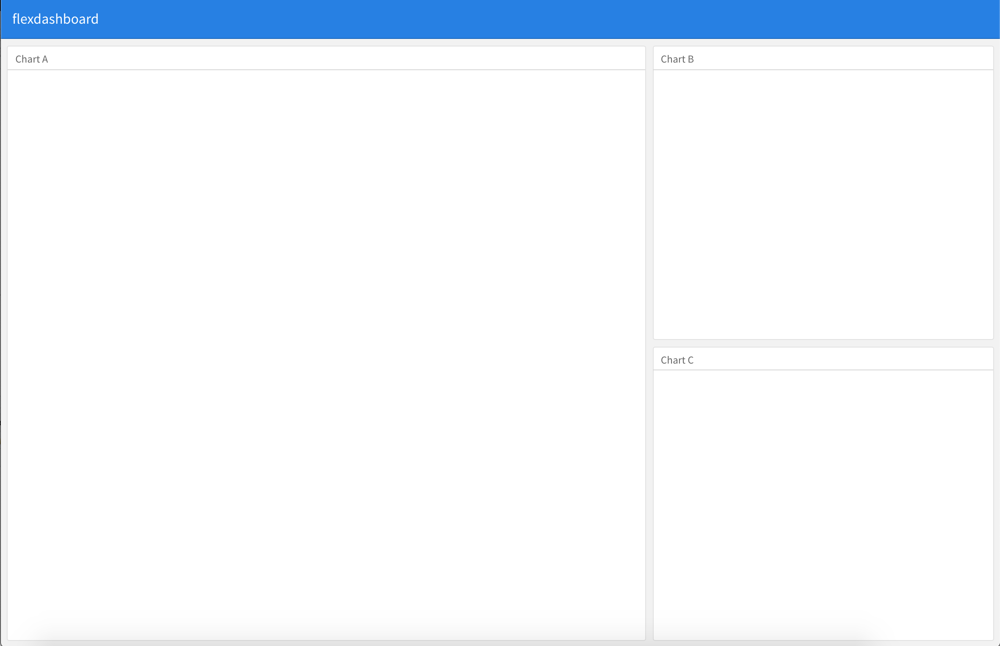
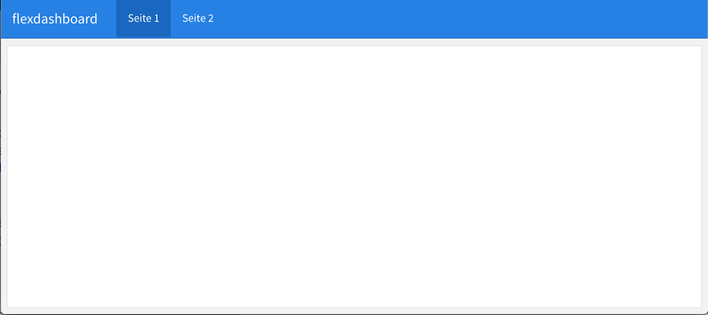
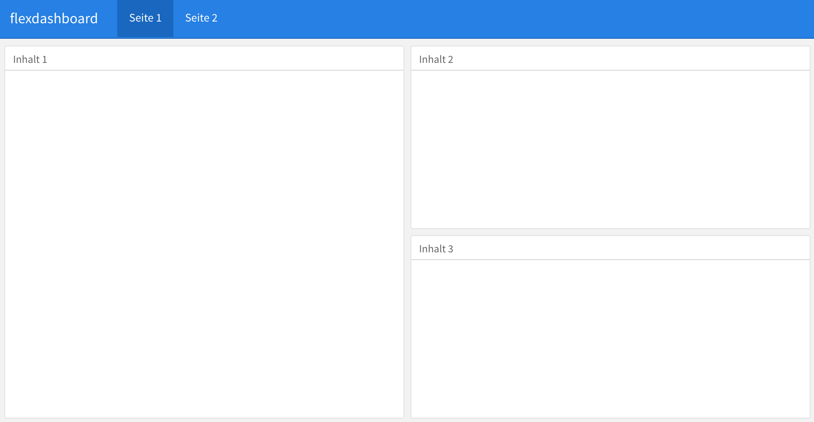
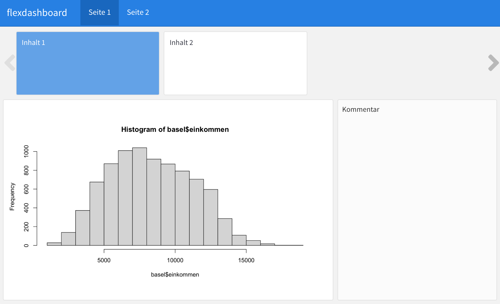
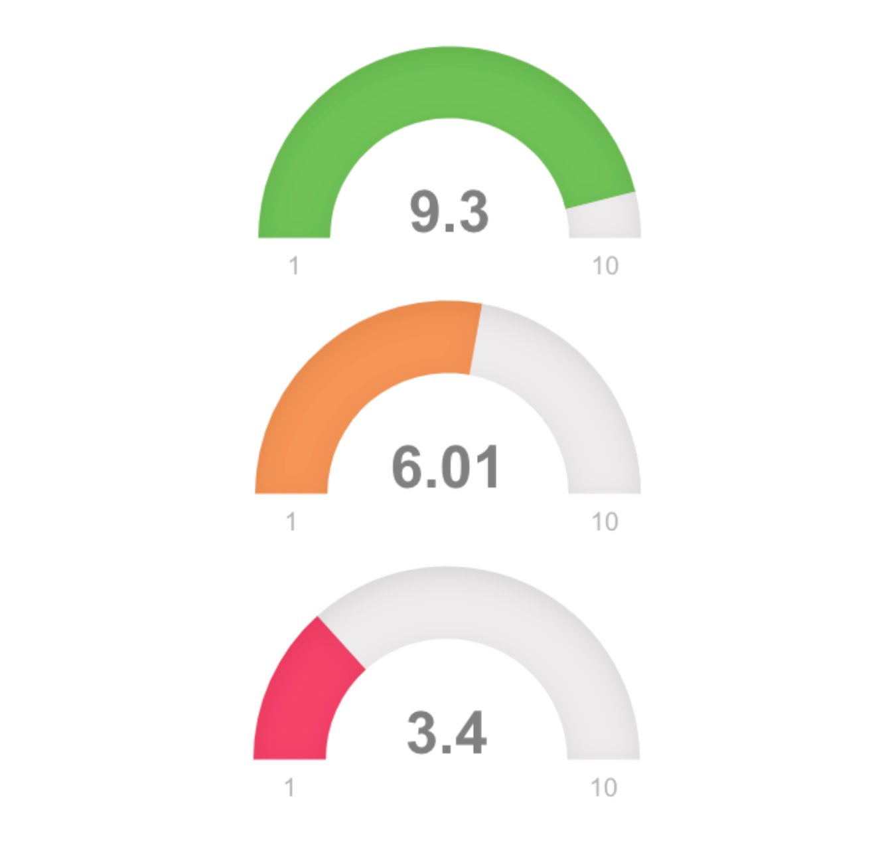

layout: true

<div class="my-footer">
  <span style="text-align:center">
    <span> 
      
    </span>
    <a href="https://therbootcamp.github.io/">
      <span style="padding-left:82px"> 
        <font color="#7E7E7E">
          www.therbootcamp.com
        </font>
      </span>
    </a>
    <a href="https://therbootcamp.github.io/">
      <font color="#7E7E7E">
       Reporting mit R | Juni 2020
      </font>
    </a>
    </span>
  </div> 

---

```{r setup, include=FALSE}
options(htmltools.dir.version = FALSE)
options(width = 110)
options(digits = 4)

# Load packages
require(tidyverse)
library(leaflet)
library(plotly)

# load color set
source("../../_materials/palette/therbootcamp_palettes.R")

# knitr options
knitr::opts_chunk$set(dpi = 300, echo = FALSE, warning = FALSE, fig.align = 'center', message= FALSE)

# special print function: avoid if possible
print2 <- function(x, nlines=10,...) {
   cat(head(capture.output(print(x,...)), nlines), sep="\n")}

basel <- read.csv("1_Data/basel.csv")

```

# Was sind Dashboards?

.pull-left4[

<ul>
  <li class="m1"><span>Einzel- oder mehrseitige <high>Präsentation</high> von Resultaten.</span></li> 
  <li class="m2"><span><high>Übersicht</high> über wichtige Ergebnisse oder <high>Parameter</high> (z.B., KPIs = Key Performance Indicators).</span></li>
  <li class="m3"><span>Können <high>dynamisch</high> und <high>interaktiv</high> sein.</span></li>
</ul>

]

.pull-right5[

<p align = "center">
  <br>
  <font style="font-size:10px">from <a href="https://towardsdatascience.com/building-an-hr-dashboard-in-r-using-flexdashboard-76d14ed3f32">towardsdatascience.com</a></font>
</p>

]

---

# Ein Beispiel

<p align = "center">
  <iframe src="https://jjallaire.shinyapps.io/shiny-crandash/#dashboard" width="100%%" height="450" style="border:none;">
</iframe><br>
  <font style="font-size:10px">from <a href="https://jjallaire.shinyapps.io/shiny-crandash/#dashboard">rstudio.com</a></font>
</p>

---

# Ein Beispiel

<p align = "center">
  <iframe src="https://therbootcamp.github.io/RmR_2020Jun/_sessions/DashboardsI/app/BerlinDashboard.html" width="100%%" height="450" style="border:none;">
</iframe><br>
  <font style="font-size:10px">from <a href="https://therbootcamp.github.io/">therbootcamp.com</a></font>
</p>


---

# Layout

.pull-left4[
<ul>
  <li class="m1"><span><high>Headers</high> bestimmen die Boxen und Seiten.</span></li>  
  <li class="m2"><span>Standard</span></li>
    <ul>
    <li><span><high>eine Seite</high> (scrollable und mehrere Seiten
  möglich).</span></li>
    <li><span><high>eine Spalte</high> (mehrere möglich, auch zeilenweise).</span></li>
  </ul><br>
  <li class="m3"><span><high>Tabs</high> möglich.</span></li>
</ul>


]

.pull-right5[

<p align = "center">
  
</p>

]

---

# Seiten

.pull-left4[
<ul style="padding-bottom:10px">
  <li class="m1"><span>Seiten werden mit <high>Titel erster Ordnung</high> definiert.</span></li> 
  <li class="m2"><span>Statt <mono>#</mono> wird <highm>=====</highm> verwendet um Bereiche zu definieren.</span></li> 

</ul>

````markdown
Seite 1
====================================
  
Seite 2
====================================
```` 


]

.pull-right5[
<br>
<p align = "center">
  
</p>

]

---

# Spalten

.pull-left4[
<ul style="padding-bottom:10px">
  <li class="m1"><span>Spalten/Zeilen werden mit <high>Titel zweiter Ordnung</high> definiert.</span></li> 
  <li class="m2"><span>Statt <mono>##</mono> wird <highm>----</highm> verwendet.</span></li> 

</ul>


````markdown
Seite 1
====================================
  
Spalte 1
------------------------------------
  
Spalte 2
------------------------------------
````


]

.pull-right5[
<br>
<p align = "center">
  
</p>

]


---

# Blöcke

.pull-left4[
<ul style="padding-bottom:10px">
  <li class="m1"><span>Mit Titel <high>dritter Ordnung</high> werden die Spalten (Zeilen) mit Blöcken gefüllt.</span></li> 
  <li class="m2"><span>Blöcke werden mit <highm>###</highm> verwendet.</span></li> 
</ul>


````markdown
Seite 1
====================================
  
Spalte 1
------------------------------------
  
### Inhalt 1

  
Spalte 2
------------------------------------
  
### Inhalt 2
  
### Inhalt 3
````


]

.pull-right5[
<br>
<p align = "center">
  
</p>

]

---

# Spaltenbreite

.pull-left4[
<ul style="padding-bottom:4px">
  <li class="m1"><span>Spaltenbreite (Zeilenhöhe) wird über <highm>Titel {data-width}</highm> definiert.</span></li> 

</ul>

````markdown
Seite 1
====================================
  
Spalte 1 {data-width = 700}
------------------------------------
  
### Inhalt 1

`r ''````{r fig.width=9}
hist(basel$einkommen)
```
  
Spalte 2
------------------------------------
  
### Inhalt 2
  
### Inhalt 3
````

]

.pull-right5[
<br>
<p align = "center">
  
</p>

]

---

# Storyboard

.pull-left4[
<ul style="padding-bottom:6px">
  <li class="m1"><span>Mit <highm>Titel {.storyboard}</highm> wird eine Seite als Storyboard definiert.</span></li>
  <li class="m2"><span>Keine Titel zweiter Ordnung nötig.</span></li> 
  <li class="m3"><span><highm>***</highm> ergänzt eine Kommentarspalte.</span></li> 

</ul>


````markdown
Seite 1 {.storyboard}
====================================
  
### Inhalt 1

Hauptinhalt
  
 ***
  
Kommentar

### Inhalt 2
````


]

.pull-right5[
<br>
<p align = "center">
  
</p>

]

---

# Komponenten

.pull-left4[
<ul>
  <li class="m1"><span>Bekannte Elemente</span></li>
  <ul>
  <li><span>Grafiken</span></li>  
  <li><span>Tabellen</span></li>
  <li><span><a href="http://stephanieevergreen.com/problem-with-dashboards/">Text</a></span></li>
  </ul><br>
  <li class="m2"><span>Neue Elemente</span></li>
  <ul>
  <li><span><mono>valueBoxe</mono>s</span></li>
  <li><span><mono>gauge</mono>s</span></li>
  <li><span><mono>htmlwidgets</mono></span></li>
  </ul>
</ul>


]

.pull-right5[
<br>
<p align = "center">
  
</p>

]

---

# <mono>valueBox</mono>

.pull-left5[

<ul style="padding-bottom:10px">
  <li class="m1"><span>Zur Hervorhebung <high>wichtiger Werte.</high></span></li>  
  <li class="m2"><span>Grosse Auswahl an Icons:</span></li>
  <ul class="level">
    <li><span><a href="https://fontawesome.com/">Font Awesome</a> Icons mit <mono>"fa-NAME"</mono>.</li></span>
    <li><span><a href="https://ionicons.com/">Ionicons</a> mit <mono>"ion-NAME"</mono>.</li></span>
    <li><span><a href="https://www.glyphicons.com/">Glyphicons</a> mit <mono>"glyphicon-NAME"</mono>.</li></span>
  </ul>
</ul>

```{r eval = FALSE, echo =TRUE}

# Ergänze valueBox
valueBox(WERT,
         caption = "TITEL",
         icon = "ICON",
         color = "FARBE")

```


]

.pull-right4[

<br>
<p align = "center">
  
</p>


]

---

# <mono>gauge</mono>

.pull-left5[

<ul style="padding-bottom:10px">
  <li class="m1"><span>Zeige wichtige Werte in <high>Relation</high> zur Skala.</span></li>  
</ul>

```{r eval = FALSE, echo =TRUE}

# Ergänze gauge
gauge(WERT, min = MIN, max = MAX,
      gaugeSectors(
        success = c(MIN_S, MAX),
        warning = c(MIN_W, MAX_W),
        danger = c(MIN, MAX_D)
      ))

```

]

.pull-right4[

<p align = "center">
  
</p>


]

---

# <mono>gauge</mono>

.pull-left5[

<ul style="padding-bottom:10px">
  <li class="m1"><span>Zeige wichtige Werte in <high>Relation</high> zur Skala.</span></li>  
</ul>

```{r eval = FALSE, echo =TRUE}

# Ergänze gauge
gauge(round(mean(basel$glueck), 2),
      min = 1, max = 10,
      gaugeSectors(
        success = c(8, 10),
        warning = c(5, 7),
        danger = c(0, 4)
        ))

```


]

.pull-right4[

<p align = "center">
  
</p>


]

---

# htmlwidgets: <mono>leaflet</mono>

.pull-left45[

<ul style="padding-bottom:10px">
  <li class="m1"><span>Interface zur <mono>leaflet</mono> JS library zum Erstellen <high>interaktiver Karten</high>.</span></li>  
</ul>

```{r eval = FALSE, echo =TRUE}
# Initiiere leaflet
leaflet() %>% 
  # Setze Anfangskoordinaten und Zoomwert
  setView(lng = 7.5885761,
          lat = 47.5595986,
          zoom = 15) %>% 
  # Zeichne Karte
  addTiles()
```


]

.pull-right45[

```{r fig.width = 1.75, fig.height = 1.5}
# Initiiere leaflet
leaflet() %>% 
  # Setze Anfangskoordinaten und Zoomwert
  setView(lng = 7.5885761, lat = 47.5595986, zoom = 15) %>% 
  # Zeichne Karte
  addTiles()
```

]

---

# htmlwidgets: <mono>leaflet</mono>

.pull-left45[

<ul style="padding-bottom:10px">
  <li class="m1"><span>Interface zur <mono>leaflet</mono> JS library zum Erstellen <high>interaktiver Karten</high>.</span></li>  
</ul>

```{r eval = FALSE, echo =TRUE}
# Initiiere leaflet
leaflet() %>% 
  # Setze Anfangskoordinaten und Zoomwert
  setView(lng = 7.5885761,
          lat = 47.5595986,
          zoom = 15) %>% 
  # Zeichne Karte
  addTiles() %>% 
  # Zeichne Marker
  addCircleMarkers(
    lng = 7.589263051748261,
    lat = 47.55892108771642)
```


]

.pull-right45[

```{r fig.width = 1.75, fig.height = 1.5}
# Initiiere leaflet
leaflet() %>% 
  # Setze Anfangskoordinaten und Zoomwert
  setView(lng = 7.5885761,
          lat = 47.5595986,
          zoom = 15) %>% 
  # Zeichne Karte
  addTiles() %>% 
  # Zeichne Marker
  addCircleMarkers(
    lng = 7.589263051748261,
    lat = 47.55892108771642)
```

]

---

# htmlwidgets: <mono>leaflet</mono>

.pull-left45[

<ul style="padding-bottom:10px">
  <li class="m1"><span>Interface zur <mono>leaflet</mono> JS library zum Erstellen <high>interaktiver Karten</high>.</span></li>  
</ul>

```{r eval = FALSE, echo =TRUE}
# Initiiere leaflet
leaflet() %>% 
  # Setze Anfangskoordinaten und Zoomwert
  setView(lng = 7.5885761,
          lat = 47.5595986,
          zoom = 15) %>% 
  # Zeichne Karte
  addTiles() %>% 
  # Zeichne Marker
  addAwesomeMarkers(
    lng = 7.589263051748261,
    lat = 47.55892108771642,
    icon = awesomeIcons(
          icon = "university",
          library = "fa"))
```


]

.pull-right45[

```{r fig.width = 1.75, fig.height = 1.5}
# Initiiere leaflet
leaflet() %>% 
  # Setze Anfangskoordinaten und Zoomwert
  setView(lng = 7.5885761,
          lat = 47.5595986,
          zoom = 15) %>% 
  # Zeichne Karte
  addTiles() %>% 
  # Zeichne Marker
  addAwesomeMarkers(
    lng = 7.589263051748261,
    lat = 47.55892108771642,
    icon = awesomeIcons(icon = "university",
      library = "fa"))
```

]

---

# htmlwidgets: <mono>plotly</mono>

.pull-left45[

<ul style="padding-bottom:10px">
  <li class="m1"><span>Interface zur <mono>plotly</mono> JS library zum Erstellen <high>interaktiver Plots</high>.</span></li>  
  <li class="m2"><span>Kann <highm>ggplot2</highm> Objekten verarbeiten.</span></li>
</ul>

```{r eval = FALSE, echo =TRUE}
p <- ggplot(basel,
            aes(alter, arztbesuche,
                col = geschlecht)) + 
  geom_point(alpha = .2) +
  geom_smooth() +
  theme_light()
  
ggplotly(p)
```


]

.pull-right45[


```{r fig.width = 1.75, fig.height = 1.5, fig.align="center"}
p <- ggplot(basel %>% slice(1:1000),
            aes(alter, arztbesuche,
                col = geschlecht)) + 
  geom_point(alpha = .2) +
  geom_smooth() +
  theme_light()
  
ggplotly(p)
```

]


---

class: middle, center

<h1><a href="https://therbootcamp.github.io/RmR_2020Jun/_sessions/DashboardsI/DashboardsI_practical.html">Practical</a></h1>

