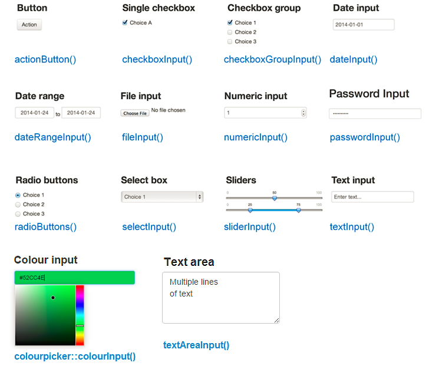

layout: true

<div class="my-footer">
  <span style="text-align:center">
    <span> 
      
    </span>
    <a href="https://therbootcamp.github.io/">
      <span style="padding-left:82px"> 
        <font color="#7E7E7E">
          www.therbootcamp.com
        </font>
      </span>
    </a>
    <a href="https://therbootcamp.github.io/">
      <font color="#7E7E7E">
       Reporting mit R | Juni 2020
      </font>
    </a>
    </span>
  </div> 

---

```{r setup, include=FALSE}
options(htmltools.dir.version = FALSE)
options(width = 110)
options(digits = 4)

# Load packages
require(tidyverse)

# load color set
source("../../_materials/palette/therbootcamp_palettes.R")

# knitr options
knitr::opts_chunk$set(dpi = 300, echo = FALSE, warning = FALSE, fig.align = 'center', message= FALSE)

# special print function: avoid if possible
print2 <- function(x, nlines=10,...) {
   cat(head(capture.output(print(x,...)), nlines), sep="\n")}

```

# Unser Dashboard

<p align = "center">
  <iframe src="https://therbootcamp.github.io/RmR_2020Jun/_sessions/DashboardsI/app/BerlinDashboard.html" width="100%%" height="450" style="border:none;">
</iframe><br>
  <font style="font-size:10px">from <a href="https://therbootcamp.github.io/">therbootcamp.com</a></font>
</p>

---

# <mono>shiny</mono>

.pull-left4[

<ul>
  <li class="m1"><span><mono>flexdashboards</mono> zeigen <high>Daten in Fenstern</high>. </span></li>
  <li class="m2"><span> Mit <mono>shiny</mono> können Dashboards um <high>interaktive Funktionen</high> erweitert werden. </span></li>
  <ul>
    <li><span>Daten <high>filtern</high></span></li>
    <li><span>Variablen <high>auswählen</high></span></li> 
</ul>

]

.pull-right5[

<p align = "center">
  <br>
  <font style="font-size:10px">from <a href="rstudio.com">rstudio.com</a></font>
</p>


]


---

# <mono>shiny</mono>


.pull-left4[

<br>

> <mono>shiny</mono> is a framework for creating web applications using R code. It is designed primarily with data scientists in mind, and to that end, you can create pretty complicated Shiny apps with no knowledge of HTML, CSS, or JavaScript.<br><br><i>Hadley Wickham</i><br>in <a href="https://mastering-shiny.org/">Mastering Shiny</a>


]

.pull-right5[
<br>
<p align = "center">
  
</p>


]

---

# Beispiele

<p align = "center">
  <iframe src="https://vnijs.shinyapps.io/radiant" width="100%%" height="450" style="border:none;">
</iframe><br>
  <font style="font-size:10px">from <a href="https://vnijs.shinyapps.io/radiant">vnijs.shinyapps.io/radiant</a></font>
</p>

---

# Beispiele

<p align = "center">
  <iframe src="https://vac-lshtm.shinyapps.io/ncov_tracker/" width="100%%" height="450" style="border:none;">
</iframe><br>
  <font style="font-size:10px">from <a href="https://vac-lshtm.shinyapps.io/ncov_tracker/">vac-lshtm.shinyapps.io/ncov_tracker</a></font>
</p>

---


# <mono>shiny</mono> App

.pull-left4[

<ul>
  <li class="m1"><span>Eine shiny App besteht aus <high>zwei Teilen</high>.</span></li>  
  <li class="m2"><span>Das <high>UI</high> (user interface) gestaltet die angezeigte Webseite.</span></li>
  <li class="m3"><span>Der <high>Server</high>-Teil verarbeitet den Input durch den Nutzer.</span></li>
</ul>

]

.pull-right5[

<p align = "center">
  
</p>


]

---

.pull-left4[

# Interfaces

<ul>
  <li class="m1"><span>Die Interaktion mit der App erfolgt über <high>Widgets</high>, z.B.:</span></li> 
    <ul class="level">
      <li><span>Slider</li></span>
      <li><span>Checkboxen</li></span>
      <li><span>Dropdown Menus</li></span>
    </ul><br>
  <li class="m2"><span>Widget-Eingaben werden server in einem <highm>input-R-Object</highm> an den Server-Code weitergegeben.</span></li>
    <ul class="level">
      <li><span><mono>input</mono> ist eine <highm>Liste</highm> mit einem Element pro Widget. </li></span>
      <li style="padding-top:10px"><span>Neue Eingabe = <high>Update</high> von <mono>input</mono>.</li></span>
    </ul>
</ul>

]

.pull-right5[

<br><br>
<p align = "center">
  <br>
  <font style="font-size:10px">adapted from <a href="https://deanattali.com/blog/building-shiny-apps-tutorial/">deanattali.com</a></font>
</p>


]

---

.pull-left4[

# <mono>input</mono>

<ul>
  <li class="m1"><span>Die Interaktion mit der App erfolgt über <high>Widgets</high>, z.B.:</span></li> 
    <ul class="level">
      <li><span>Slider</li></span>
      <li><span>Checkboxen</li></span>
      <li><span>Dropdown Menus</li></span>
    </ul><br>
  <li class="m2"><span>Widget-Eingaben werden server in einem <highm>input-R-Object</highm> an den Server-Code weitergegeben.</span></li>
    <ul class="level">
      <li><span><mono>input</mono> ist eine <highm>Liste</highm> mit einem Element pro Widget. </li></span>
      <li style="padding-top:10px"><span>Neue Eingabe = <high>Update</high> von <mono>input</mono>.</li></span>
    </ul>
</ul>

]

.pull-right5[

<br><br><br>
<p align = "center">
  <br>
</p>


]

---

.pull-left4[

# Reaktivität

<ul>
  <li class="m1"><span><mono>input</mono> kann nur in <high>reaktiver Umwelt</high> gelesen werden (z.B., <mono>render*</mono>).</span></li>
  <li class="m2"><span>Reaktive Umwelten bzw. <high>reaktive Objekte</high> (eigentlich eine Funktion) können mit <mono>reactive()</mono> gesetzt werden.</span></li>  
  <li class="m3"><span>Jeder <high>Codeblock</high>, in dem reaktive Objekte verwendet werden, wird erneut ausgeführt wenn es eine Eingabe gibt.</span></li>
</ul>

]

.pull-right5[

<br><br><br>
<p align = "center">
  <br>
</p>


]

---

.pull-left4[

# Reaktivität

<ul>
  <li class="m1"><span><mono>input</mono> kann nur in <high>reaktiver Umwelt</high> gelesen werden (z.B., <mono>render*</mono>).</span></li>
  <li class="m2"><span>Reaktive Umwelten bzw. <high>reaktive Objekte</high> (eigentlich eine Funktion) können mit <mono>reactive()</mono> gesetzt werden.</span></li>  
  <li class="m3"><span>Jeder <high>Codeblock</high>, in dem reaktive Objekte verwendet werden, wird erneut ausgeführt wenn es eine Eingabe gibt.</span></li>
</ul>

]

.pull-right5[

<br><br><br>
<p align = "center">
  <br>
</p>


]


---

.pull-left4[

# <mono>render*()</mono>

<ul>
  <li class="m1"><span>Um Veränderungen durch <high>reaktive Objekte</high> zu ermöglichen, müssen die entsprechenden Outputs mit speziellen Funktionen <high>gerendert</high> werden.</span></li>  
  <li class="m2"><span>Verschiedene <highm>render*()</highm> Funktionen existieren in <mono>shiny</mono>, z.B.:</span></li>
      <ul class="level">
      <li><span><mono>renderPlot()</mono></li></span>
      <li><span><mono>renderTable()</mono></li></span>
      <li><span><mono>renderText()</mono></li></span>
    </ul>
  <li class="m3"><span>Viele Pakete bieten <high>eigene</high> render Funktionen, z.B. <mono>renderLeaflet()</mono> oder <mono>renderPlotly()</mono>.</span></li>
</ul>

]

.pull-right5[

<br><br><br>
<p align = "center">
  <br>
</p>


]

---


# <mono>{...}</mono>

.pull-left4[

<ul>
  <li class="m1"><span>Mit geschweiften Klammern <mono>{}</mono> können mehrere Zeilen Code als zusammenhängender <high>Code Block</high> definiert werden.</span></li>  
  <li class="m2"><span>Verwende <mono>{}</mono> innerhalb <mono>reactive()</mono> und <mono>render*()</mono> Funktionen.</span></li>  
</ul>


]

.pull-right5[

```{r echo = TRUE}
# Beispiel Code Block
{
  a <- 1
  a
  a + 2
}
```


```{r eval = FALSE, echo = TRUE}
# Code Block in renderPlot()
renderPlot({
  n_colors <- length(unique(basel$bildung))
  farben <- viridis(n_colors)
  ggplot(...) +
    geom_point() +
    scale_color_manual(values = farben)
  })
```


]

---

.pull-left4[

# Beispiel

<ul>
  <li class="m1"><span>Input definiert <high>Merkmal</high>.</span></li> 
  <li class="m2"><span>Reaktiver Datensatz, <high>gefiltert</high> nach Input.</span></li> 
  <li class="m3"><span>Verwendung des reaktiven Datensatzes in zwei verschiedenen <high>Plots</high>.</span></li> 
</ul>

]

.pull-right5[

<br><br>

```{r eval = FALSE, echo = TRUE}
# Widget für User Input
checkboxGroupInput("MERKMAL", "TITEL", ...)

# Reaktive Daten generieren
DATEN_REAKTIV <- reactive({
  DATEN %>% 
    filter(VARIABLE %in% input$MERKMAL)
  })

# Verwende Reaktive Daten mit Klammern
# Plot 1
renderPlot({
  DATEN_REAKTIV() %>% 
    ggplot(aes(...)) +
    geom_point()
  })

# Plot 2
renderPlot({
  DATEN_REAKTIV() %>% 
    ggplot(aes(...)) +
    geom_histogram()
  })
```


]

---

# Ansätze

.pull-left4[

<ul>
  <li class="m1"><span><mono>shiny</mono></span></li>  
    <ul class="level">
      <li><span><b>Pro</b>: Volle Flexibilität.</li></span>
      <li><span><b>Contra</b>: Hohe Komplexität.</li></span>
    </ul>
  <li class="m2"><span><mono>shinydashboard</mono></span></li>
    <ul class="level">
      <li><span><b>Pro</b>: Niedrigere Komplexität.</li></span>
      <li><span><b>Contra</b>: Weniger Flexibilität.</li></span>
    </ul>
  <li class="m3"><span><mono>flexdashboard</mono></span></li>
    <ul class="level">
      <li><span><b>Pro</b>: Sehr einfach, da Ausbau von Markdown.</li></span>
      <li><span><b>Contra</b>: Niedrige Flexibilität.</li></span>
    </ul>
</ul>

]

.pull-right5[

<p align = "center">
  <br>
  <font style="font-size:10px">from <a href="www.benfoolery.com/">benfoolery.com</a></font>
</p>


]

---

class: middle, center

<h1><a href="https://therbootcamp.github.io/RmR_2020Jun/_sessions/DashboardsII/DashboardsII_practical.html">Practical</a></h1>

