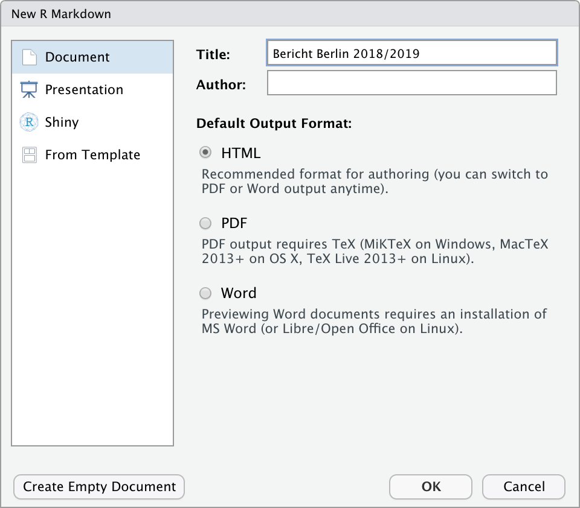
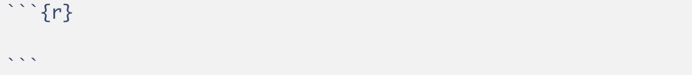
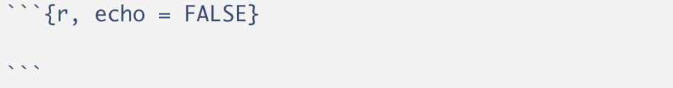

<style>
pre code,  .md:not(.use-csslab) pre code {
  white-space: pre-wrap;
  }
</style>

```{r setup, echo = FALSE, message = FALSE, warning = FALSE}
knitr::opts_chunk$set(comment = NA, 
                      fig.width = 6, 
                      fig.height = 6,
                      fig.align = 'center',
                      echo = FALSE, 
                      eval = FALSE, 
                      warning = FALSE,
                      message = FALSE,
                      tidy.opts=list(width.cutoff=40))

# Lade Pakete
library(tidyverse)
library(knitr)
library(kableExtra)
library(lubridate)

# Lade Daten
# Airbnb <- read_csv('1_Data/Airbnb.csv') 

```

<p align="center" width="100%">
  
  <br>
  <font style="font-size:10px">adapted from <a href="https://news.Airbnb.com/de/unterkunften-fur-covid-19-einsatzkrafte/">Airbnb.com</a></font>
</p>


# {.tabset}

## Überblick

In diesem Practical machst du deine ersten Schritte mit R Markdown. 

Am Ende des Practicals wirst du wissen wie man:

1. Text in das Dokument einfügt.
2. Inline Code im Text verwendet. 
3. Chunks erstellt und einstellt. 

## Aufgaben

### A - Setup

1. Öffne dein `TheRBootcamp` R Projekt. Es sollte die Ordner `1_Data`, `2_Assets`, und `3_Markdown` enthalten. 

2. Öffne ein neues RMarkdown Skript und wähle das Template "HTML" aus (siehe screenshot).

<p align="center" width="100%">
  
</p>

3. Trage als Titel `Bericht Berlin 2018/2019` ein.

3. Speichere das neue Markdown Skript unter dem Namen `Airbnb_level_one.Rmd` im `3_Markdown` Ordner ab.

4. Lösche alles unterhalb des `setup` Code Chunks.

5. Lade die Pakete `tidyverse` und `lubridate` im `setup` Chunk.

```{r, echo = T, eval = T}
# Lade Pakete
library(tidyverse)
library(lubridate)
```

6. Lade den `Airbnb` Datensatz mit `read_csv()` ebenfalls im `setup` Chunk mit dem Code unten.

```{r echo = TRUE}
# Lade Airbnb Datensatz
Airbnb <- read_csv("../1_Data/Airbnb.csv")
```

7. Verwende den Code unten um nur die beiden Jahre `2018` und `2019` aus den Daten auszuwählen und ein neues Objekt `Airbnb_1819` zu erstellen.

```{r echo = TRUE}
# Wähle Jahre 2018 und 2019 aus
Airbnb_1819 <- Airbnb %>% 
  filter(Erstellungsdatum > "2018-01-01", 
         Erstellungsdatum < "2019-12-31")
```

### B - Präambel

1. Unter den `setup` Chunk, setze eine Überschrift auf drittem Level (`###`) mit Titel `Präambel`. 
````markdown
### Präambel
````

2. Nun setze unter die Überschrift den folgenden Text. 

````wrap
Dieser Bericht analysiert Veränderungen in den Neueinstellungen und den Preisen von Airbnb Objekten in Berlin, Deutschland. Er wurde zum Zwecke der Übung auf Basis öffentlich verfügbarer Daten erstellt und repräsentiert einzig die Position der Autoren. Es besteht keine Beziehung zu Airbnb.  
````

3. `Knitte` das Dokument. Sieht alles in Ordnung aus?  

### C - Neueinstellungen: Text Teil 1

1. Setze eine weitere Überschrift auf dritter Ebene (`###`) mit Titel `Neueinstellungen` und darunter eine Überschrift auf vierter Ebene (`####`) mit dem Titel `Entwicklung`.

````markdown
### Neueinstellungen

#### Entwicklung
````

2. Füge nun diesen Text ein. Er enthält einige Werte, die du gleich durch inline Code ersetzen wirst.

````wrap
Seit 02.01.2018 wurden in Berlin 5007 Airbnb Wohnungen eingestellt. Von diesen Wohnungn weisen aktuell 73% Verfügbarkeiten von durchschnittlich 47.5 Tagen für die nächsten 3 Monate auf.

Einstellungen von Airbnb Wohnungen haben im letzten Jahr stark zugenommen. Im Jahr 2019 wurden insgesamt 3274 neue Wohnungen eingestellt, wohingegend im Jahr 2018 nur 1733 Wohnungen eingestellt wurden. Dies entspricht einem Zuwachs von 89%.
````

3. Tausche zunächst das Datum an zweiter Stelle im Text durch den folgenden inline Code aus. Nicht vergessen, der Code muss zwischen zwei Gravis (&grave;r Code&grave;) gesetzt werden. Knitte das Dokument.  

````text
r min(Airbnb_1819$Erstellungsdatum)
````

4. Jetzt sollte der Text ein Datum enthalten, welches aber noch nicht ganz richtig formatiert ist. Hier hilft die `strftime()` Funktion. Versuche mit dem folgenden inline Code das Datum in das richtige Format zu bringen.   

````text
r strftime(min(Airbnb_1819$Erstellungsdatum), "%d.%m.%Y")
````
5. Als nächstes ersetze die Anzahl der Wohnungen durch `nrow(Airbnb_1819)`. Nicht das `r` am Anfang vergessen! 

6. Ersetze nun Prozentsatz der Wohnungen durch `round(mean(Airbnb_1819$Verfügbarkeit_90Tage > 0) * 100)` und die durchschnittliche Verfügbarkeit durch `round(mean(Airbnb_1819$Verfügbarkeit_90Tage[Airbnb_1819$Verfügbarkeit_90Tage>0]),1)`. Jetzt sollten alle Zahlen des ersten Absatz durch Code ersetzt worden sein. Überprüfe ob alles stimmt. 

7. Im nächsten Absatz ersetze die ersten beiden Zahlen durch `n_2019 <- sum(year(Airbnb_1819$Erstellungsdatum) == 2019); n_2019` und `n_2018 <- sum(year(Airbnb_1819$Erstellungsdatum) == 2018); n_2018`. In diesen beiden Fällen siehst du, dass auch Zuweisungen in inline Code möglich sind. 

8. Ersetze nun den wert des Zuwachses am Ende des Absatzes durch `(round(n_2019/n_2018, 2) - 1)*100`, was, wie du siehst, auf die beiden zuvor im inline Code definierten Objekte zurückgreift. Knitte das Dokument und überprüfe, ob nun alle Zahlen einwandfrei wiedergegeben werden.

9. Zuletzt verwende &ast;&ast; um den gesamten zweiten Absatz fett zu setzen. Setze hierfür einmal die zwei Asteriske vor das erste und nach dem letzten Wort des Absatzes. Nun alles wie im Zieldokument?

### D - Neueinstellungen: Grafik Teil 1

1. Erstelle einen neuen Code Chunk. Einen Chunk erstellst du mit zunächst drei Gravis &grave;&grave;&grave;, dann direkt danach in der selben Zeile `{r}` und anschliessend nocheinmal drei Ticks in einer Zeile darunter. Wie in der Abbildung unten sollte sich der Hintergrund automatisch grau einfärben. 

<p align="center"></img></p>

2. Kopiere in den Chunk, d.h., zwischen die zwei Zeilen mit den drei Gravis/Ticks, den Code unten, welcher eine erste Version der ersten Grafik im Bericht generiert. 

```R
# Plotte Häufigkeiten
ggplot(Airbnb_1819 %>% 
      group_by(Jahr = year(Erstellungsdatum), 
               Monat_tmp = month(Erstellungsdatum)) %>% 
      summarize(Monat = as_factor(paste(first(Jahr), first(Monat_tmp), sep = '-')),
                Wohnungen = n()), 
      aes(x = Monat, y = Wohnungen, fill = Jahr)) + 
      geom_bar(stat = 'identity', position = 'dodge') + 
      theme(legend.position = 'none',
      axis.text.x = element_text(angle = 45, hjust = 1)) 
```

### E - Chunk-Optionen 

1. Aktuell zeigt dein "geknittetes" Dokument sowohl den Code für den Plot als auch den Plot selbst an. Das Dokument soll aber nur den Plot zeigen. Ergänze in den Chunk Optionen, d.h., innerhalb der geschwungenen Klammern nach dem `r`, `echo = FALSE`. Danach knitte das Dokument nocheinmal.  

<p align="center"></img></p>

2. Das Dokument sollte nun den Code im Chunk nicht mehr anzeigen. Mache nun dieses Setting rückgängig, d.h., lösche `echo = FALSE`, es gibt nämlich einen zweiten Weg diesen und alle zukünftigen Code Chunks zu verstecken. Knitte das Dokument nachdem du das `echo = FALSE` entfernt hast. 

3. Gehe nun zum Setup-Chunk ganz am Anfang es Dokuments (unter dem YAML header). Dort siehst du folgende Code Zeile `knitr::opts_chunk$set(echo = TRUE)`, die aktuell impliziert, dass alle Code Chunks per default angezeigt werden. Setze nun hier `echo = FALSE` und knitte das Dokument. Der Code Chunk sollte nun wieder versteckt sein. Behalte diese Einstellung auch für die weiteren Sessions bei.

4. Ergänze nun zusätzlich in den allgemeinen Chunk-Optionen `message = FALSE` und `warning = FALSE`, was vollständig verhindert, dass Messages oder Warnings im Bericht auftauchen. Die finalen Settings sollten nun so aussehen. 

```R
knitr::opts_chunk$set(echo = FALSE, message = FALSE, warning = FALSE)
```

### F - Neueinstellungen: Text Teil 2

1. Setze unten im Script eine weitere Überschrift auf vierter Ebene (`####`) mit dem Titel `Stadtteile`.

2. Unter die Überschrift setze den folgenden Text.

```wrap
Neueinstellungen fallen nach wie vor sehr unterschiedlich in den Bezirken aus. Die meisten Neueinstellungen im Jahr 2019 gab es in Friedrichshain-Kreuzberg, die wenigsten in Marzahn - Hellersdorf.

Die grössten Veränderungen gab es in Marzahn - Hellersdorf und Treptow - Köpenick. In Marzahn - Hellersdorf schrumpften die Neueinstellungen um -13.3%, in Treptow - Köpenick wuchsen die Neueinstellungen um 137.8%.
```

3. Vor den Text setze den folgenden Chunk, welcher die Häufigkeiten der Neueinstellungen über die Stadtteile berechnet und im Objekt `stadtteile` speichert.

```R
# Berechne Häufigkeiten über die Bezirke
stadtteile <- Airbnb_1819 %>% 
              group_by(Stadtteil, 
                       Jahr = year(Erstellungsdatum)) %>% 
              summarize(Wohnungen = n()) %>% 
              ungroup() %>% 
              arrange(desc(Jahr), Wohnungen) %>% 
              mutate(Stadtteil = as_factor(Stadtteil))
```
4. Ersetze nun die die zwei im ersten Paragraph erwähnten Stadtteile durch `stadtteile %>% filter(Jahr == 2019) %>% pull(Stadtteil) %>% last()` und `stadtteile %>% filter(Jahr == 2019) %>% pull(Stadtteil) %>% first()`. 
Knitte das Dokument und schaue, ob die richtigen Namen eingesetzt wurden. 

5. Kreiere einen neuen Chunk zwischen den beiden Absätzen mit dem folgenden Code, welcher einige Objekte erstellt, die die inline Ergänzungen im darauf folgenden Absatz erleichtern werden.  

```
# Veränderung über die Stadtteile
veränderung = stadtteile %>% 
  group_by(Stadtteil) %>% 
  summarize(veränderung = (100 * (Wohnungen[Jahr == 2019]/Wohnungen[Jahr == 2018] - 1)) %>% round(1))

# Geringsten Veränderung
min_veränderung = veränderung %>% 
  slice(which.min(veränderung)) %>% 
  pull(veränderung)

# Stadteil mit der geringsten Veränderung
min_stadtteil = veränderung %>% 
  slice(which.min(veränderung)) %>% 
  pull(Stadtteil)

# Grösste Veränderung
max_veränderung = veränderung %>% 
  slice(which.max(veränderung)) %>% 
  pull(veränderung)

# Stadteil mit der grössten Veränderung
max_stadtteil = veränderung %>% 
  slice(which.max(veränderung)) %>% 
  pull(Stadtteil)
```

6. Ersetze die ersten beiden Stadtteil-Nennungen in beiden Sätzen durch `min_stadtteil` und `max_stadtteil` und knitte das Dokument. Passt alles?

7. Ersetze nun `schrumpften` und `wuchsen` durch `ifelse(min_veränderung > 0, "wuchsen", "schrumpften")` und `ifelse(max_veränderung > 0, "wuchsen", "schrumpften")`. Die beiden Codestücke können dann selbst entscheiden, ob die Veränderung eine positive oder negative ist und das jeweils richtige Wort einsetzen. 

8. Abschliessend ersetze die beiden numerischen Werte durch `min_veränderung` und `max_veränderung`. 
Knitte das Dokument und überprüfe, ob alles in Ordnung ist.

### G - Neueinstellungen: Grafik Teil 2

1. Erstelle einen neuen Chunk mit dem folgenden Code für die zweite Grafik.

```R
# Plotte Häufigkeieten der Stadtteile
ggplot(stadtteile, 
       aes(y = Stadtteil, x = Wohnungen, group = Jahr, fill = Jahr)) + 
       geom_bar(stat = 'identity', position = 'dodge') + 
       theme(legend.position = 'none') + 
       labs(y = '')
```

2. Knitte das Dokument. Der erste Teil ist hiermit abgeschlossen. 


## Datensatz

Der [Airbnb.csv](https://raw.githubusercontent.com/therbootcamp/RmR_2020Apr/master/_materials/case/Airbnb.csv) Datensatz enthält Zahlen zu 9868 Berliner Airbnbs 


|Variable | Beschreibung |
|:-------------|:-------------------------------------|
|Preis| Preis pro Nacht|
 |Erstellungsdatum| Eröffnungsdatum des Airbnbs |
 |Unterkunftsart| Appartement, Loft, Haus, etc.|
 |Schlafplätze| Anzahl Schlafplätze |
 |Schlafzimmer| Anzahl Schlafzimmer |
 |Badezimmer| Anzahl Badezimmer |
 |Reinigungsgebühr| Reinigungsgebühr |
 |Verfügbarkeit_90Tage| |
 |Viertel| In welchem Viertel befindet sich das Airbnb |
 |Stadtteil| In welchem Stadtteil befindet sich das Airbnb |
 |Breitengrad| Breitengrad|
 |Längengrad| Längengrad |
 |Host_id| Host id |
 |Host_seit| Erfahrung des Hosts |
 |Host_antwortzeit| Host Antwortzeit|
 |Host_antwortrate| Host Antwortrate |
 |Host_superhost| Superhost Ja/Nein |
 |Host_anzahl| Anzahl Gäste |
 |Rating_gesamt| Gesamtrating |
 |Rating_genauigkeit| Genauigkeitsrating |
 |Rating_sauberkeit| Sauberkeitsrating |
 |Rating_checkin| Checkinrating |
 |Rating_kommunikation| Kommunikationsrating |
 |Rating_lage| Lagerating |
 |Rating_wertigkeit| Wertigkeitsrating |
 |Küche| Küche vorhanden TRUE/FALSE |
 |Wifi| WLAN vorhanden TRUE/FALSE |
 |TV| TV vorhanden TRUE/FALSE |
 |Kaffeemaschine| Kaffeemaschine vorhanden TRUE/FALSE|
 |Geschirrspüler| Geschirrspüler vorhanden TRUE/FALSE|
 |Terrasse_Balkon| Terrasse/Balkon vorhanden TRUE/FALSE|
 |Badewanne| Badewanne vorhanden TRUE/FALSE|
 |Check_in_24h| 24h Check-In vorhanden TRUE/FALSE|


## Funktionen

### Paket

|Paket| Installation|
|:------|:------|
|`tidyverse`|`install.packages("tidyverse")`|
|`lubridate`|`install.packages("lubridate")`|


### Funktionen


| Funktion| Paket | Beschreibung |
|:---|:------|:---------------------------------------------|
| `strftime`|`lubridate`| Formatierung von Daten |
| `ggplot`|`ggplot`| Erstellen von Grafiken | 


## Materialien

- Allgemeiner Einstieg in [**RMarkdown**](https://rmarkdown.rstudio.com/lesson-1.html).
- [**DIE Referenz**](https://bookdown.org/yihui/rmarkdown/) für RMarkdown bis ins letzte Detail.
- [**Rmarkdown**](https://cran.r-project.org/web/packages/rmarkdown/index.html) Dokumentation und Befehlsreferenz.


