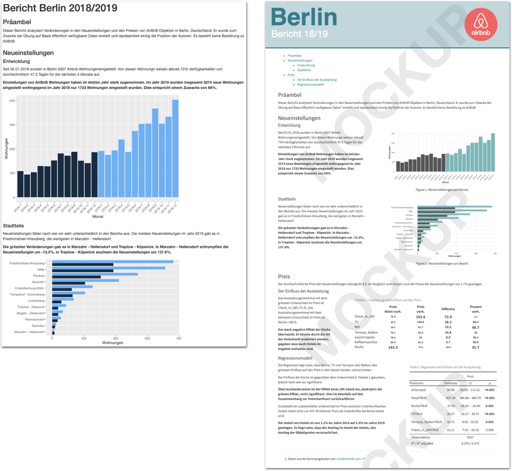
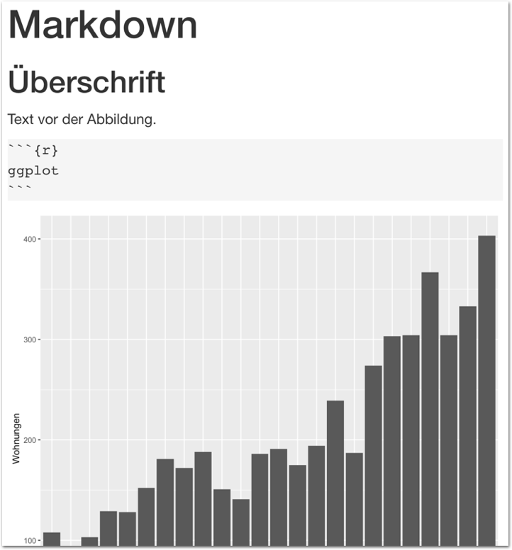
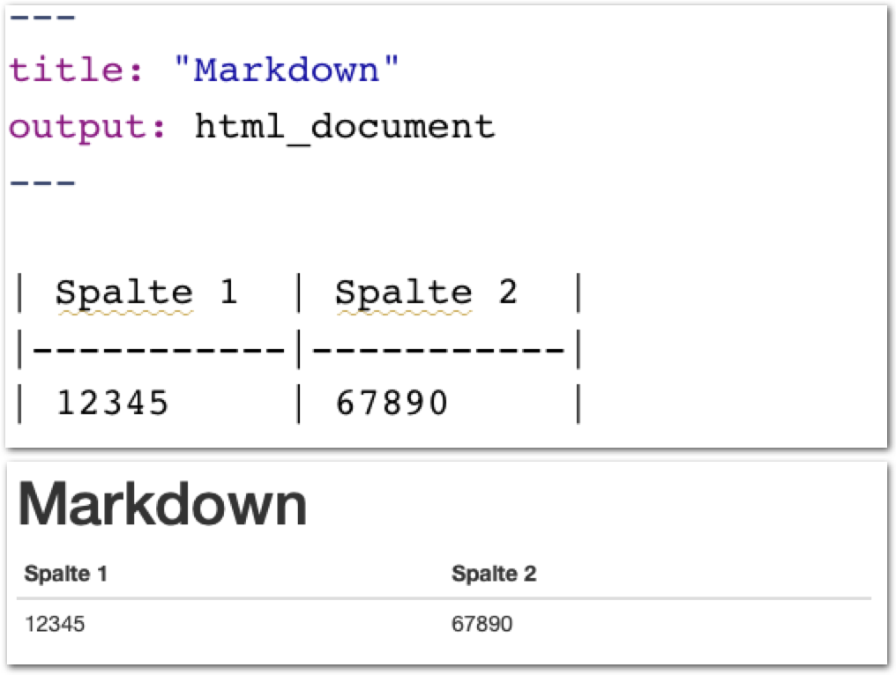
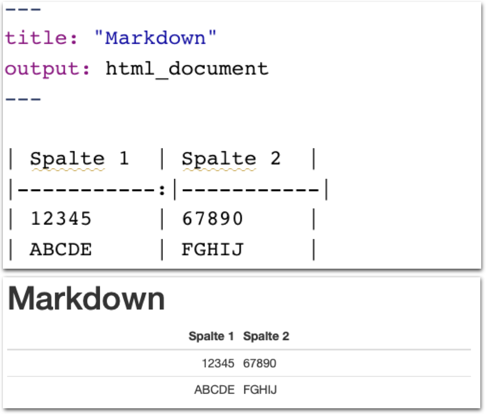

layout: true

<div class="my-footer">
  <span style="text-align:center">
    <span> 
      
    </span>
    <a href="https://therbootcamp.github.io/">
      <span style="padding-left:82px"> 
        <font color="#7E7E7E">
          www.therbootcamp.com
        </font>
      </span>
    </a>
    <a href="https://therbootcamp.github.io/">
      <font color="#7E7E7E">
       Reporting mit R | Februar 2021
      </font>
    </a>
    </span>
  </div> 

---

```{r setup, include=FALSE}
options(htmltools.dir.version = FALSE)
options(width = 110)
options(digits = 4)

# Load packages
require(tidyverse)
require(knitr)
require(kable)
require(kableExtra)
library(lubridate)
# load color set
source("../../_materials/palette/therbootcamp_palettes.R")

# knitr options
knitr::opts_chunk$set(echo = FALSE, 
                      warning = FALSE, 
                      message= FALSE,
                      comment = NA)
# special print function: avoid if possible
print2 <- function(x, nlines=10,...) {
   cat(head(capture.output(print(x,...)), nlines), sep="\n")}

# load data
airbnb_1819 <- read_csv('1_Data/airbnb.csv') %>% 
  filter(Erstellungsdatum > "2018-01-01", 
         Erstellungsdatum < "2019-12-31")

theme_set(theme_minimal())

cols = "https://www.colourlovers.com/palette/3498539/airbnb"

```

.pull-left3[

# Nächste Schritte

<ul>
  <li class="m1"><span>Abbildungen skalieren.</span></li>
  <li class="m2"><span>Tabellen.</span></li>
  <li class="m3"><span>Fussnoten & Links.</span></li>
</ul>

]

.pull-right6[

<p align = "center">
  
</p>

]

---

.pull-left4[

# Grafiken skalieren

<ul>
  <li class="m1"><span>Die <high>Darstellung</high> von Grafiken kann in den <mono>Chunk</mono>-Settings angepasst werden.</span></li> 
  <li class="m2"><span>Die Argumente beginnen (meist) mit <highm>fig.*</highm>.</span></li> 
</ul>

<table style="cellspacing:0; cellpadding:0; border:none; padding-top:10px" width=100%>
  <col width="40%">
  <col width="60%">
<tr>
  <td bgcolor="white">
    <b>Argument</b>
  </td>
  <td bgcolor="white">
    <b>Beschreibung</b>
  </td> 
</tr>
<tr>
  <td bgcolor="white">
  <mono>fig.width</mono>, <mono>fig.height</mono>
  </td>
  <td bgcolor="white">
  <high>Breite</high> und <high>Höhe</high> in inches.
  </td> 
</tr>
<tr>
  <td bgcolor="white">
  <mono>fig.asp</mono>
  </td>
  <td bgcolor="white">
   <high>Seitenverhältnis</high>: Höhe relativ zur Breite.   
  </td> 
</tr>
<tr>
  <td bgcolor="white">
  <mono>fig.align</mono>
  </td>
  <td bgcolor="white">
  <high>Position</high> der Abbildung: <mono>'center'</mono>, <mono>'left'</mono>, <mono>'right'</mono>.
  </td> 
</tr>
<tr>
  <td bgcolor="white">
  <mono>dpi</mono> 
  </td>
  <td bgcolor="white">
  <high>Auflösung</high> der Abbildung (dots per inch).
  </td> 
</tr>
</table>
]

.pull-right5[
<br>
<p align = "center">
  
</p>

]

---

.pull-left4[

# Grafiken skalieren

<ul>
  <li class="m1"><span>Die <high>Darstellung</high> von Grafiken kann in den <mono>Chunk</mono>-Settings angepasst werden.</span></li> 
  <li class="m2"><span>Die Argumente beginnen (meist) mit <highm>fig.*</highm>.</span></li> 
</ul>

<table style="cellspacing:0; cellpadding:0; border:none; padding-top:10px" width=100%>
  <col width="40%">
  <col width="60%">
<tr>
  <td bgcolor="white">
    <b>Argument</b>
  </td>
  <td bgcolor="white">
    <b>Beschreibung</b>
  </td> 
</tr>
<tr>
  <td bgcolor="white">
  <mono>fig.width</mono>, <mono>fig.height</mono>
  </td>
  <td bgcolor="white">
  <high>Breite</high> und <high>Höhe</high> in inches.
  </td> 
</tr>
<tr>
  <td bgcolor="white">
  <mono>fig.asp</mono>
  </td>
  <td bgcolor="white">
   <high>Seitenverhältnis</high>: Höhe relativ zur Breite.   
  </td> 
</tr>
<tr>
  <td bgcolor="white">
  <mono>fig.align</mono>
  </td>
  <td bgcolor="white">
  <high>Position</high> der Abbildung: <mono>'center'</mono>, <mono>'left'</mono>, <mono>'right'</mono>.
  </td> 
</tr>
<tr>
  <td bgcolor="white">
  <mono>dpi</mono> 
  </td>
  <td bgcolor="white">
  <high>Auflösung</high> der Abbildung (dots per inch).
  </td> 
</tr>
</table>
]

.pull-right5[
<br>
<p align = "center">
  
</p>

]

---

.pull-left4[

# Grafiken skalieren

<ul>
  <li class="m1"><span>Die <high>Darstellung</high> von Grafiken kann in den <mono>Chunk</mono>-Settings angepasst werden.</span></li> 
  <li class="m2"><span>Die Argumente beginnen (meist) mit <highm>fig.*</highm>.</span></li> 
</ul>

<table style="cellspacing:0; cellpadding:0; border:none; padding-top:10px" width=100%>
  <col width="40%">
  <col width="60%">
<tr>
  <td bgcolor="white">
    <b>Argument</b>
  </td>
  <td bgcolor="white">
    <b>Beschreibung</b>
  </td> 
</tr>
<tr>
  <td bgcolor="white">
  <mono>fig.width</mono>, <mono>fig.height</mono>
  </td>
  <td bgcolor="white">
  <high>Breite</high> und <high>Höhe</high> in inches.
  </td> 
</tr>
<tr>
  <td bgcolor="white">
  <mono>fig.asp</mono>
  </td>
  <td bgcolor="white">
   <high>Seitenverhältnis</high>: Höhe relativ zur Breite.   
  </td> 
</tr>
<tr>
  <td bgcolor="white">
  <mono>fig.align</mono>
  </td>
  <td bgcolor="white">
  <high>Position</high> der Abbildung: <mono>'center'</mono>, <mono>'left'</mono>, <mono>'right'</mono>.
  </td> 
</tr>
<tr>
  <td bgcolor="white">
  <mono>dpi</mono> 
  </td>
  <td bgcolor="white">
  <high>Auflösung</high> der Abbildung (dots per inch).
  </td> 
</tr>
</table>
]

.pull-right5[
<br>
<p align = "center">
  
</p>

]

---

.pull-left4[

# Grafiken skalieren

<ul>
  <li class="m1"><span>Die <high>Darstellung</high> von Grafiken kann in den <mono>Chunk</mono>-Settings angepasst werden.</span></li> 
  <li class="m2"><span>Die Argumente beginnen (meist) mit <highm>fig.*</highm>.</span></li> 
</ul>

<table style="cellspacing:0; cellpadding:0; border:none; padding-top:10px" width=100%>
  <col width="40%">
  <col width="60%">
<tr>
  <td bgcolor="white">
    <b>Argument</b>
  </td>
  <td bgcolor="white">
    <b>Beschreibung</b>
  </td> 
</tr>
<tr>
  <td bgcolor="white">
  <mono>fig.width</mono>, <mono>fig.height</mono>
  </td>
  <td bgcolor="white">
  <high>Breite</high> und <high>Höhe</high> in inches.
  </td> 
</tr>
<tr>
  <td bgcolor="white">
  <mono>fig.asp</mono>
  </td>
  <td bgcolor="white">
   <high>Seitenverhältnis</high>: Höhe relativ zur Breite.   
  </td> 
</tr>
<tr>
  <td bgcolor="white">
  <mono>fig.align</mono>
  </td>
  <td bgcolor="white">
  <high>Position</high> der Abbildung: <mono>'center'</mono>, <mono>'left'</mono>, <mono>'right'</mono>.
  </td> 
</tr>
<tr>
  <td bgcolor="white">
  <mono>dpi</mono> 
  </td>
  <td bgcolor="white">
  <high>Auflösung</high> der Abbildung (dots per inch).
  </td> 
</tr>
</table>
]

.pull-right5[
<br>
<p align = "center">
  
</p>

]

---

.pull-left4[

# Grafiken skalieren

<ul>
  <li class="m1"><span>Die <high>Darstellung</high> von Grafiken kann in den <mono>Chunk</mono>-Settings angepasst werden.</span></li> 
  <li class="m2"><span>Die Argumente beginnen (meist) mit <highm>fig.*</highm>.</span></li> 
</ul>

<table style="cellspacing:0; cellpadding:0; border:none; padding-top:10px" width=100%>
  <col width="40%">
  <col width="60%">
<tr>
  <td bgcolor="white">
    <b>Argument</b>
  </td>
  <td bgcolor="white">
    <b>Beschreibung</b>
  </td> 
</tr>
<tr>
  <td bgcolor="white">
  <mono>fig.width</mono>, <mono>fig.height</mono>
  </td>
  <td bgcolor="white">
  <high>Breite</high> und <high>Höhe</high> in inches.
  </td> 
</tr>
<tr>
  <td bgcolor="white">
  <mono>fig.asp</mono>
  </td>
  <td bgcolor="white">
   <high>Seitenverhältnis</high>: Höhe relativ zur Breite.   
  </td> 
</tr>
<tr>
  <td bgcolor="white">
  <mono>fig.align</mono>
  </td>
  <td bgcolor="white">
  <high>Position</high> der Abbildung: <mono>'center'</mono>, <mono>'left'</mono>, <mono>'right'</mono>.
  </td> 
</tr>
<tr>
  <td bgcolor="white">
  <mono>dpi</mono> 
  </td>
  <td bgcolor="white">
  <high>Auflösung</high> der Abbildung (dots per inch).
  </td> 
</tr>
</table>
]

.pull-right5[
<br>
<p align = "center">
  
</p>

]


---

.pull-left4[

# Bildunterschrift

<ul>
  <li class="m1"><span>Bildunterschriften können durch <highm>fig.cap</highm> gesetzt.</span></li> 
  <li class="m2"><span>Der Text kann <high>innerhalb des Chunks</high> definiert werden.</span></li> 
</ul>


]

.pull-right5[
<br>
<p align = "center">
  
</p>

]


---

.pull-left4[

# Deskriptive Tabellen

<ul>
  <li class="m1"><span>Mit <mono>knitr</mono> und <mono>kableExtra</mono> können <high><mono>tibbles</mono> als Tabellen</high> inkludiert werden.</span></li> 
</ul>

<table style="cellspacing:0; cellpadding:0; border:none; padding-top:10px" width=100%>
  <col width="40%">
  <col width="60%">
<tr>
  <td bgcolor="white">
    <b>Argument</b>
  </td>
  <td bgcolor="white">
    <b>Beschreibung</b>
  </td> 
</tr>
<tr>
  <td bgcolor="white">
  <mono>format</mono>
  </td>
  <td bgcolor="white"><high>Ausgabeformat</high>: 
  <mono>"html"</mon>, <mono>"latex"</mono>
  </td> 
</tr>
<tr>
  <td bgcolor="white">
  <mono>digit</mono>
  </td>
  <td bgcolor="white">
   Anzahl <high>Nachkommastellen</high>.   
  </td> 
</tr>
<tr>
  <td bgcolor="white">
  <mono>col.names</mono>
  </td>
  <td bgcolor="white">
  <high>Spaltennamen</high>.
  </td> 
</tr>
<tr>
  <td bgcolor="white">
  <mono>escape</mono> 
  </td>
  <td bgcolor="white">
  Spaltennamen <high>nicht</high> als HTML <high>interpretieren</high>.
  </td> 
</tr>
<tr>
  <td bgcolor="white">
  <mono>align</mono> 
  </td>
  <td bgcolor="white">
  <high>Ausrichtung</high> der Spalten: <mono><b>l</b>eft</mono>, <mono><b>c</b>enter</mono>, <mono><b>r</b>ight</mono>.
  </td> 
</tr>
<tr>
  <td bgcolor="white">
  <mono>caption</mono> 
  </td>
  <td bgcolor="white">
  <high>Tabellenüberschrift</high>. 
  </td> 
</tr>
</table>


]

.pull-right5[
<br>
<p align = "center">
  
</p>

]

---

.pull-left4[

# Deskriptive Tabellen

<ul>
  <li class="m1"><span>Mit <mono>knitr</mono> und <mono>kableExtra</mono> können <high><mono>tibbles</mono> als Tabellen</high> inkludiert werden.</span></li> 
</ul>

<table style="cellspacing:0; cellpadding:0; border:none; padding-top:10px" width=100%>
  <col width="40%">
  <col width="60%">
<tr>
  <td bgcolor="white">
    <b>Argument</b>
  </td>
  <td bgcolor="white">
    <b>Beschreibung</b>
  </td> 
</tr>
<tr>
  <td bgcolor="white">
  <mono>format</mono>
  </td>
  <td bgcolor="white"><high>Ausgabeformat</high>: 
  <mono>"html"</mon>, <mono>"latex"</mono>
  </td> 
</tr>
<tr>
  <td bgcolor="white">
  <mono>digit</mono>
  </td>
  <td bgcolor="white">
   Anzahl <high>Nachkommastellen</high>.   
  </td> 
</tr>
<tr>
  <td bgcolor="white">
  <mono>col.names</mono>
  </td>
  <td bgcolor="white">
  <high>Spaltennamen</high>.
  </td> 
</tr>
<tr>
  <td bgcolor="white">
  <mono>escape</mono> 
  </td>
  <td bgcolor="white">
  Spaltennamen <high>nicht</high> als HTML <high>interpretieren</high>.
  </td> 
</tr>
<tr>
  <td bgcolor="white">
  <mono>align</mono> 
  </td>
  <td bgcolor="white">
  <high>Ausrichtung</high> der Spalten: <mono><b>l</b>eft</mono>, <mono><b>c</b>enter</mono>, <mono><b>r</b>ight</mono>.
  </td> 
</tr>
<tr>
  <td bgcolor="white">
  <mono>caption</mono> 
  </td>
  <td bgcolor="white">
  <high>Tabellenüberschrift</high>. 
  </td> 
</tr>
</table>


]

.pull-right5[
<br>
<p align = "center">
  
</p>

]

---

.pull-left4[

# Deskriptive Tabellen

<ul>
  <li class="m1"><span>Mit <mono>knitr</mono> und <mono>kableExtra</mono> können <high><mono>tibbles</mono> als Tabellen</high> inkludiert werden.</span></li> 
</ul>

<table style="cellspacing:0; cellpadding:0; border:none; padding-top:10px" width=100%>
  <col width="40%">
  <col width="60%">
<tr>
  <td bgcolor="white">
    <b>Argument</b>
  </td>
  <td bgcolor="white">
    <b>Beschreibung</b>
  </td> 
</tr>
<tr>
  <td bgcolor="white">
  <mono>format</mono>
  </td>
  <td bgcolor="white"><high>Ausgabeformat</high>: 
  <mono>"html"</mon>, <mono>"latex"</mono>
  </td> 
</tr>
<tr>
  <td bgcolor="white">
  <mono>digit</mono>
  </td>
  <td bgcolor="white">
   Anzahl <high>Nachkommastellen</high>.   
  </td> 
</tr>
<tr>
  <td bgcolor="white">
  <mono>col.names</mono>
  </td>
  <td bgcolor="white">
  <high>Spaltennamen</high>.
  </td> 
</tr>
<tr>
  <td bgcolor="white">
  <mono>escape</mono> 
  </td>
  <td bgcolor="white">
  Spaltennamen <high>nicht</high> als HTML <high>interpretieren</high>.
  </td> 
</tr>
<tr>
  <td bgcolor="white">
  <mono>align</mono> 
  </td>
  <td bgcolor="white">
  <high>Ausrichtung</high> der Spalten: <mono><b>l</b>eft</mono>, <mono><b>c</b>enter</mono>, <mono><b>r</b>ight</mono>.
  </td> 
</tr>
<tr>
  <td bgcolor="white">
  <mono>caption</mono> 
  </td>
  <td bgcolor="white">
  <high>Tabellenüberschrift</high>. 
  </td> 
</tr>
</table>


]

.pull-right5[
<br>
<p align = "center">
  
</p>

]

---

.pull-left4[

# Deskriptive Tabellen

<ul>
  <li class="m1"><span>Mit <mono>knitr</mono> und <mono>kableExtra</mono> können <high><mono>tibbles</mono> als Tabellen</high> inkludiert werden.</span></li> 
</ul>

<table style="cellspacing:0; cellpadding:0; border:none; padding-top:10px" width=100%>
  <col width="40%">
  <col width="60%">
<tr>
  <td bgcolor="white">
    <b>Argument</b>
  </td>
  <td bgcolor="white">
    <b>Beschreibung</b>
  </td> 
</tr>
<tr>
  <td bgcolor="white">
  <mono>format</mono>
  </td>
  <td bgcolor="white"><high>Ausgabeformat</high>: 
  <mono>"html"</mon>, <mono>"latex"</mono>
  </td> 
</tr>
<tr>
  <td bgcolor="white">
  <mono>digit</mono>
  </td>
  <td bgcolor="white">
   Anzahl <high>Nachkommastellen</high>.   
  </td> 
</tr>
<tr>
  <td bgcolor="white">
  <mono>col.names</mono>
  </td>
  <td bgcolor="white">
  <high>Spaltennamen</high>.
  </td> 
</tr>
<tr>
  <td bgcolor="white">
  <mono>escape</mono> 
  </td>
  <td bgcolor="white">
  Spaltennamen <high>nicht</high> als HTML <high>interpretieren</high>.
  </td> 
</tr>
<tr>
  <td bgcolor="white">
  <mono>align</mono> 
  </td>
  <td bgcolor="white">
  <high>Ausrichtung</high> der Spalten: <mono><b>l</b>eft</mono>, <mono><b>c</b>enter</mono>, <mono><b>r</b>ight</mono>.
  </td> 
</tr>
<tr>
  <td bgcolor="white">
  <mono>caption</mono> 
  </td>
  <td bgcolor="white">
  <high>Tabellenüberschrift</high>. 
  </td> 
</tr>
</table>


]

.pull-right5[
<br>
<p align = "center">
  
</p>

]

---

.pull-left4[

# Deskriptive Tabellen

<ul>
  <li class="m1"><span>Mit <mono>knitr</mono> und <mono>kableExtra</mono> können <high><mono>tibbles</mono> als Tabellen</high> inkludiert werden.</span></li> 
</ul>

<table style="cellspacing:0; cellpadding:0; border:none; padding-top:10px" width=100%>
  <col width="40%">
  <col width="60%">
<tr>
  <td bgcolor="white">
    <b>Argument</b>
  </td>
  <td bgcolor="white">
    <b>Beschreibung</b>
  </td> 
</tr>
<tr>
  <td bgcolor="white">
  <mono>format</mono>
  </td>
  <td bgcolor="white"><high>Ausgabeformat</high>: 
  <mono>"html"</mon>, <mono>"latex"</mono>
  </td> 
</tr>
<tr>
  <td bgcolor="white">
  <mono>digit</mono>
  </td>
  <td bgcolor="white">
   Anzahl <high>Nachkommastellen</high>.   
  </td> 
</tr>
<tr>
  <td bgcolor="white">
  <mono>col.names</mono>
  </td>
  <td bgcolor="white">
  <high>Spaltennamen</high>.
  </td> 
</tr>
<tr>
  <td bgcolor="white">
  <mono>escape</mono> 
  </td>
  <td bgcolor="white">
  Spaltennamen <high>nicht</high> als HTML <high>interpretieren</high>.
  </td> 
</tr>
<tr>
  <td bgcolor="white">
  <mono>align</mono> 
  </td>
  <td bgcolor="white">
  <high>Ausrichtung</high> der Spalten: <mono><b>l</b>eft</mono>, <mono><b>c</b>enter</mono>, <mono><b>r</b>ight</mono>.
  </td> 
</tr>
<tr>
  <td bgcolor="white">
  <mono>caption</mono> 
  </td>
  <td bgcolor="white">
  <high>Tabellenüberschrift</high>. 
  </td> 
</tr>
</table>


]

.pull-right5[
<br>
<p align = "center">
  
</p>

]

---

.pull-left4[

# Deskriptive Tabellen

<ul>
  <li class="m1"><span>Mit <mono>knitr</mono> und <mono>kableExtra</mono> können <high><mono>tibbles</mono> als Tabellen</high> inkludiert werden.</span></li> 
</ul>

<table style="cellspacing:0; cellpadding:0; border:none; padding-top:10px" width=100%>
  <col width="40%">
  <col width="60%">
<tr>
  <td bgcolor="white">
    <b>Argument</b>
  </td>
  <td bgcolor="white">
    <b>Beschreibung</b>
  </td> 
</tr>
<tr>
  <td bgcolor="white">
  <mono>column_spec</mono>
  </td>
  <td bgcolor="white">
  Formatierungder <high>Spalten</high>, e.g., <mono>width</mono>.
  </td> 
</tr>
<tr>
  <td bgcolor="white">
  <mono>cell_spec</mono>
  </td>
  <td bgcolor="white">
  Formatierung der <high>Zellen</high>, e.g., <mono>bold</mono> und <mono>font_size</mono>.
  </td> 
</tr>
<tr>
  <td bgcolor="white">
  <mono>spec_font_size</mono>
  </td>
  <td bgcolor="white">
  <high>Helferfunktion</high> für <mono>font_size</mono>.
  </td> 
</tr>
</table>


]

.pull-right5[
<br>
<p align = "center">
  
</p>

]

---

.pull-left4[

# Deskriptive Tabellen

<ul>
  <li class="m1"><span>Mit <mono>knitr</mono> und <mono>kableExtra</mono> können <high><mono>tibbles</mono> als Tabellen</high> inkludiert werden.</span></li> 
</ul>

<table style="cellspacing:0; cellpadding:0; border:none; padding-top:10px" width=100%>
  <col width="40%">
  <col width="60%">
<tr>
  <td bgcolor="white">
    <b>Argument</b>
  </td>
  <td bgcolor="white">
    <b>Beschreibung</b>
  </td> 
</tr>
<tr>
  <td bgcolor="white">
  <mono>column_spec</mono>
  </td>
  <td bgcolor="white">
  Formatierungder <high>Spalten</high>, e.g., <mono>width</mono>.
  </td> 
</tr>
<tr>
  <td bgcolor="white">
  <mono>cell_spec</mono>
  </td>
  <td bgcolor="white">
  Formatierung der <high>Zellen</high>, e.g., <mono>bold</mono> und <mono>font_size</mono>.
  </td> 
</tr>
<tr>
  <td bgcolor="white">
  <mono>spec_font_size</mono>
  </td>
  <td bgcolor="white">
  <high>Helferfunktion</high> für <mono>font_size</mono>.
  </td> 
</tr>
</table>


]

.pull-right5[
<br>
<p align = "center">
  
</p>

]

---

.pull-left4[

# Deskriptive Tabellen

<ul>
  <li class="m1"><span>Mit <mono>knitr</mono> und <mono>kableExtra</mono> können <high><mono>tibbles</mono> als Tabellen</high> inkludiert werden.</span></li> 
</ul>

<table style="cellspacing:0; cellpadding:0; border:none; padding-top:10px" width=100%>
  <col width="40%">
  <col width="60%">
<tr>
  <td bgcolor="white">
    <b>Argument</b>
  </td>
  <td bgcolor="white">
    <b>Beschreibung</b>
  </td> 
</tr>
<tr>
  <td bgcolor="white">
  <mono>column_spec</mono>
  </td>
  <td bgcolor="white">
  Formatierungder <high>Spalten</high>, e.g., <mono>width</mono>.
  </td> 
</tr>
<tr>
  <td bgcolor="white">
  <mono>cell_spec</mono>
  </td>
  <td bgcolor="white">
  Formatierung der <high>Zellen</high>, e.g., <mono>bold</mono> und <mono>font_size</mono>.
  </td> 
</tr>
<tr>
  <td bgcolor="white">
  <mono>spec_font_size</mono>
  </td>
  <td bgcolor="white">
  <high>Helferfunktion</high> für <mono>font_size</mono>.
  </td> 
</tr>
</table>


]

.pull-right5[
<br>
<p align = "center">
  
</p>

]
---

.pull-left4[

# Statistische Modelle

<ul>
  <li class="m1"><span>Mit der <mono>tab_model</mono> Funktion des <mono>sjPlot</mono> Pakets lassen sich <high>statistische Modelle</high> als (HTML) Tabellen ausgeben.</span></li>
</ul>

<table style="cellspacing:0; cellpadding:0; border:none; padding-top:10px" width=100%>
  <col width="40%">
  <col width="60%">
<tr>
  <td bgcolor="white">
    <b>Argument</b>
  </td>
  <td bgcolor="white">
    <b>Beschreibung</b>
  </td> 
</tr>
<tr>
  <td bgcolor="white">
  <mono>pred.labels</mono> 
  </td>
  <td bgcolor="white">
  <high>Namen</high> der Prädiktoren anpassen.</td>
</tr>
<tr>
  <td bgcolor="white">
  <mono>title</mono>
  </td>
  <td bgcolor="white">
  Tabellenüberschrift.
  </td> 
</tr>
<tr>
  <td bgcolor="white">
  <mono>show.*</mono>
  </td>
  <td bgcolor="white">
  Bestimme <high>welche Werte</high> dargestellt werden.
  </td> 
</tr>
</table>
]

.pull-right5[
<br>
<p align = "center">
  
</p>

]

---

.pull-left4[

# Statistische Modelle

<ul>
  <li class="m1"><span>Mit der <mono>tab_model</mono> Funktion des <mono>sjPlot</mono> Pakets lassen sich <high>statistische Modelle</high> als (HTML) Tabellen ausgeben.</span>
 </li>
</ul>

<table style="cellspacing:0; cellpadding:0; border:none; padding-top:10px; width=100%">
  <col width="40%">
  <col width="60%">
<tr>
  <td bgcolor="white">
    <b>Argument</b>
  </td>
  <td bgcolor="white">
    <b>Beschreibung</b>
  </td> 
</tr>
<tr>
  <td bgcolor="white">
  <mono>pred.labels</mono> 
  </td>
  <td bgcolor="white">
  <high>Namen</high> der Prädiktoren anpassen.</td>
</tr>
<tr>
  <td bgcolor="white">
  <mono>title</mono>
  </td>
  <td bgcolor="white">
  Tabellenüberschrift.
  </td> 
</tr>
<tr>
  <td bgcolor="white">
  <mono>show.*</mono>
  </td>
  <td bgcolor="white">
  Bestimme <high>welche Werte</high> dargestellt werden.
  </td> 
</tr>
</table>
]

.pull-right5[
<br>
<p align = "center">
  
</p>

]

---

.pull-left4[

# Statistische Modelle

<ul>
  <li class="m1"><span>Mit der <mono>tab_model</mono> Funktion des <mono>sjPlot</mono> Pakets lassen sich <high>statistische Modelle</high> als (HTML) Tabellen ausgeben.</span></li>
</ul>

<table style="cellspacing:0; cellpadding:0; border:none; padding-top:10px; width=100%">
  <col width="40%">
  <col width="60%">
<tr>
  <td bgcolor="white">
    <b>Argument</b>
  </td>
  <td bgcolor="white">
    <b>Beschreibung</b>
  </td> 
</tr>
<tr>
  <td bgcolor="white">
  <mono>pred.labels</mono> 
  </td>
  <td bgcolor="white">
  <high>Namen</high> der Prädiktoren anpassen.</td>
</tr>
<tr>
  <td bgcolor="white">
  <mono>title</mono>
  </td>
  <td bgcolor="white">
  Tabellenüberschrift.
  </td> 
</tr>
<tr>
  <td bgcolor="white">
  <mono>show.*</mono>
  </td>
  <td bgcolor="white">
  Bestimme <high>welche Werte</high> dargestellt werden.
  </td> 
</tr>
</table>
]

.pull-right5[
<br>
<p align = "center">
  
</p>

]

---

.pull-left4[

# Links, Fussnoten

<ul>
  <li class="m1"><span>Zum Einbinden von Links und Fussnoten gibt es ebenfalls spezielle  <high>Markdown Syntax</high>.</span></li>
</ul>

<table style="cellspacing:0; cellpadding:0; border:none; padding-top:10px" width=100%>
  <col width="40%">
  <col width="60%">
<tr>
  <td bgcolor="white">
    <b>Markdown</b>
  </td>
  <td bgcolor="white">
    <b>Beschreibung</b>
  </td> 
</tr>
<tr>
  <td bgcolor="white">
  <mono>&lsqb;Name&rsqb;(URL)</mono>
  </td>
  <td bgcolor="white">
  <high>Link</high>. Name erscheint im Text, URL nicht.
  </td> 
</tr>
<tr>
  <td bgcolor="white">
  <mono>^&lsqb;Text&rsqb;</mono>
  </td>
  <td bgcolor="white">
   <high>Fussnoten</high> werden unten am Text angehängt.    
  </td> 
</tr>
<tr>
  <td bgcolor="white">
  <mono>***</mono>
  </td>
  <td bgcolor="white">
   Fügt eine <high>horizontale</high> Trennlinie ein.
  </td> 
</tr>
</table>

]

.pull-right5[
<br><br>
<p align = "center">
  
</p>

]

---

.pull-left4[

# Quotes

<ul>
  <li class="m1"><span><high>Zitationen</high> (Quotes) werden direkt in Markdown erstellt.</span></li>
</ul>

<table style="cellspacing:0; cellpadding:0; border:none; padding-top:10px" width=100%>
  <col width="40%">
  <col width="60%">
<tr>
  <td bgcolor="white">
    <b>Markdown</b>
  </td>
  <td bgcolor="white">
    <b>Beschreibung</b>
  </td> 
</tr>
<tr>
  <td bgcolor="white">
  <mono>> block quote</mono>
  </td>
  <td bgcolor="white">
  Text wird als <high>Zitat</high> angezeigt.<high></high>
  </td> 
</tr>
<tr>
  <td bgcolor="white">
  <mono></mono> 
  </td>
  <td bgcolor="white">
  </td> 
</tr>
<tr>
  <td bgcolor="white">
  <mono></mono>
  </td>
  <td bgcolor="white">
  </td> 
</tr>
</table>

]

.pull-right5[
<br><br>
<p align = "center">
  
</p>


]

---

.pull-left4[

# Markdown Tabellen

<ul>
 <li class="m1"><span>Um <high>einfache Tabellen</high> zu erstellen ist kein Zusatzpaket notwendig.</span></li> 
</ul>

<table style="cellspacing:0; cellpadding:0; border:none; padding-top:10px" width=100%>
  <col width="40%">
  <col width="60%">
<tr>
  <td bgcolor="white">
    <b>Markdown</b>
  </td>
  <td bgcolor="white">
    <b>Beschreibung</b>
  </td> 
</tr>
<tr>
  <td bgcolor="white">
  <mono>|</mono>
  </td>
  <td bgcolor="white">
  Definition von <high>Spaltentrennung</high>
  </td> 
</tr>
<tr>
  <td bgcolor="white">
  <mono>---</mono>
  </td>
  <td bgcolor="white">
   Definition von <high>horizontalen Linien</high>.    
  </td> 
</tr>
<tr>
  <td bgcolor="white">
  <mono>|:,  |: :|, :|</mono> 
  </td>
  <td bgcolor="white">
  links-bündig, zentriert, rechts-bündig
  </td> 
</tr>
<tr>
  <td bgcolor="white">
  <mono></mono>
  </td>
  <td bgcolor="white">
  </td> 
</tr>
</table>

]

.pull-right5[
<br><br>
<p align = "center">
  
</p>

]

---

.pull-left4[

# Markdown Tabellen

<ul>
 <li class="m1"><span>Um <high>einfache Tabellen</high> zu erstellen ist kein Zusatzpaket notwendig.</span></li> 
</ul>

<table style="cellspacing:0; cellpadding:0; border:none; padding-top:10px" width=100%>
  <col width="40%">
  <col width="60%">
<tr>
  <td bgcolor="white">
    <b>Markdown</b>
  </td>
  <td bgcolor="white">
    <b>Beschreibung</b>
  </td> 
</tr>
<tr>
  <td bgcolor="white">
  <mono>|</mono>
  </td>
  <td bgcolor="white">
  Definition von <high>Spaltentrennung</high>
  </td> 
</tr>
<tr>
  <td bgcolor="white">
  <mono>---</mono>
  </td>
  <td bgcolor="white">
   Definition von <high>horizontalen Linien</high>.    
  </td> 
</tr>
<tr>
  <td bgcolor="white">
  <mono>|:,  |: :|, :|</mono> 
  </td>
  <td bgcolor="white">
  links-bündig, zentriert, rechts-bündig
  </td> 
</tr>
<tr>
  <td bgcolor="white">
  <mono></mono>
  </td>
  <td bgcolor="white">
  </td> 
</tr>
</table>

]

.pull-right5[
<br><br>
<p align = "center">
  
</p>

]

---

.pull-left4[

# Markdown Tabellen

<ul>
 <li class="m1"><span>Um <high>einfache Tabellen</high> zu erstellen ist kein Zusatzpaket notwendig.</span></li> 
</ul>

<table style="cellspacing:0; cellpadding:0; border:none; padding-top:10px" width=100%>
  <col width="40%">
  <col width="60%">
<tr>
  <td bgcolor="white">
    <b>Markdown</b>
  </td>
  <td bgcolor="white">
    <b>Beschreibung</b>
  </td> 
</tr>
<tr>
  <td bgcolor="white">
  <mono>|</mono>
  </td>
  <td bgcolor="white">
  Definition von <high>Spaltentrennung</high>
  </td> 
</tr>
<tr>
  <td bgcolor="white">
  <mono>---</mono>
  </td>
  <td bgcolor="white">
   Definition von <high>horizontalen Linien</high>.    
  </td> 
</tr>
<tr>
  <td bgcolor="white">
  <mono>|:,  |: :|, :|</mono> 
  </td>
  <td bgcolor="white">
  links-bündig, zentriert, rechts-bündig
  </td> 
</tr>
<tr>
  <td bgcolor="white">
  <mono></mono>
  </td>
  <td bgcolor="white">
  </td> 
</tr>
</table>

]

.pull-right5[
<br><br>
<p align = "center">
  
</p>

]

---

.pull-left4[

# Markdown Tabellen

<ul>
 <li class="m1"><span>Um <high>einfache Tabellen</high> zu erstellen ist kein Zusatzpaket notwendig.</span></li> 
</ul>

<table style="cellspacing:0; cellpadding:0; border:none; padding-top:10px" width=100%>
  <col width="40%">
  <col width="60%">
<tr>
  <td bgcolor="white">
    <b>Markdown</b>
  </td>
  <td bgcolor="white">
    <b>Beschreibung</b>
  </td> 
</tr>
<tr>
  <td bgcolor="white">
  <mono>|</mono>
  </td>
  <td bgcolor="white">
  Definition von <high>Spaltentrennung</high>
  </td> 
</tr>
<tr>
  <td bgcolor="white">
  <mono>---</mono>
  </td>
  <td bgcolor="white">
   Definition von <high>horizontalen Linien</high>.    
  </td> 
</tr>
<tr>
  <td bgcolor="white">
  <mono>|:,  |: :|, :|</mono> 
  </td>
  <td bgcolor="white">
  links-bündig, zentriert, rechts-bündig
  </td> 
</tr>
<tr>
  <td bgcolor="white">
  <mono></mono>
  </td>
  <td bgcolor="white">
  </td> 
</tr>
</table>

]

.pull-right5[
<br><br>
<p align = "center">
  
</p>

]

---

.pull-left4[

# Markdown Tabellen

<ul>
 <li class="m1"><span>Um <high>einfache Tabellen</high> zu erstellen ist kein Zusatzpaket notwendig.</span></li> 
</ul>

<table style="cellspacing:0; cellpadding:0; border:none; padding-top:10px" width=100%>
  <col width="40%">
  <col width="60%">
<tr>
  <td bgcolor="white">
    <b>Markdown</b>
  </td>
  <td bgcolor="white">
    <b>Beschreibung</b>
  </td> 
</tr>
<tr>
  <td bgcolor="white">
  <mono>|</mono>
  </td>
  <td bgcolor="white">
  Definition von <high>Spaltentrennung</high>
  </td> 
</tr>
<tr>
  <td bgcolor="white">
  <mono>---</mono>
  </td>
  <td bgcolor="white">
   Definition von <high>horizontalen Linien</high>.    
  </td> 
</tr>
<tr>
  <td bgcolor="white">
  <mono>|:,  |: :|, :|</mono> 
  </td>
  <td bgcolor="white">
  links-bündig, zentriert, rechts-bündig
  </td> 
</tr>
<tr>
  <td bgcolor="white">
  <mono></mono>
  </td>
  <td bgcolor="white">
  </td> 
</tr>
</table>

]

.pull-right5[
<br><br>
<p align = "center">
  
</p>

]

---

.pull-left4[

# Markdown Tabellen

<ul>
 <li class="m1"><span>Um <high>einfache Tabellen</high> zu erstellen ist kein Zusatzpaket notwendig.</span></li> 
</ul>

<table style="cellspacing:0; cellpadding:0; border:none; padding-top:10px" width=100%>
  <col width="40%">
  <col width="60%">
<tr>
  <td bgcolor="white">
    <b>Markdown</b>
  </td>
  <td bgcolor="white">
    <b>Beschreibung</b>
  </td> 
</tr>
<tr>
  <td bgcolor="white">
  <mono>|</mono>
  </td>
  <td bgcolor="white">
  Definition von <high>Spaltentrennung</high>
  </td> 
</tr>
<tr>
  <td bgcolor="white">
  <mono>---</mono>
  </td>
  <td bgcolor="white">
   Definition von <high>horizontalen Linien</high>.    
  </td> 
</tr>
<tr>
  <td bgcolor="white">
  <mono>|:,  |: :|, :|</mono> 
  </td>
  <td bgcolor="white">
  links-bündig, zentriert, rechts-bündig
  </td> 
</tr>
<tr>
  <td bgcolor="white">
  <mono></mono>
  </td>
  <td bgcolor="white">
  </td> 
</tr>
</table>

]

.pull-right5[
<br><br>
<p align = "center">
  
</p>

]

---

.pull-left4[

# Markdown Tabellen

<ul>
 <li class="m1"><span>Um <high>einfache Tabellen</high> zu erstellen ist kein Zusatzpaket notwendig.</span></li> 
</ul>

<table style="cellspacing:0; cellpadding:0; border:none; padding-top:10px" width=100%>
  <col width="40%">
  <col width="60%">
<tr>
  <td bgcolor="white">
    <b>Markdown</b>
  </td>
  <td bgcolor="white">
    <b>Beschreibung</b>
  </td> 
</tr>
<tr>
  <td bgcolor="white">
  <mono>|</mono>
  </td>
  <td bgcolor="white">
  Definition von <high>Spaltentrennung</high>
  </td> 
</tr>
<tr>
  <td bgcolor="white">
  <mono>---</mono>
  </td>
  <td bgcolor="white">
   Definition von <high>horizontalen Linien</high>.    
  </td> 
</tr>
<tr>
  <td bgcolor="white">
  <mono>|:,  |: :|, :|</mono> 
  </td>
  <td bgcolor="white">
  links-bündig, zentriert, rechts-bündig
  </td> 
</tr>
<tr>
  <td bgcolor="white">
  <mono></mono>
  </td>
  <td bgcolor="white">
  </td> 
</tr>
</table>

]

.pull-right5[
<br><br>
<p align = "center">
  
</p>

]

---

.pull-left4[

# Markdown Tabellen

<ul>
 <li class="m1"><span>Um <high>einfache Tabellen</high> zu erstellen ist kein Zusatzpaket notwendig.</span></li> 
</ul>

<table style="cellspacing:0; cellpadding:0; border:none; padding-top:10px" width=100%>
  <col width="40%">
  <col width="60%">
<tr>
  <td bgcolor="white">
    <b>Markdown</b>
  </td>
  <td bgcolor="white">
    <b>Beschreibung</b>
  </td> 
</tr>
<tr>
  <td bgcolor="white">
  <mono>|</mono>
  </td>
  <td bgcolor="white">
  Definition von <high>Spaltentrennung</high>
  </td> 
</tr>
<tr>
  <td bgcolor="white">
  <mono>---</mono>
  </td>
  <td bgcolor="white">
   Definition von <high>horizontalen Linien</high>.    
  </td> 
</tr>
<tr>
  <td bgcolor="white">
  <mono>|:,  |: :|, :|</mono> 
  </td>
  <td bgcolor="white">
  links-bündig, zentriert, rechts-bündig
  </td> 
</tr>
<tr>
  <td bgcolor="white">
  <mono></mono>
  </td>
  <td bgcolor="white">
  </td> 
</tr>
</table>

]

.pull-right5[
<br><br>
<p align = "center">
  
</p>

]

---
class: middle, center

<h1><a href="https://therbootcamp.github.io/RmR_2021Feb/_sessions/Markdown2/Markdown2_practical.html">Practical</a></h1>

