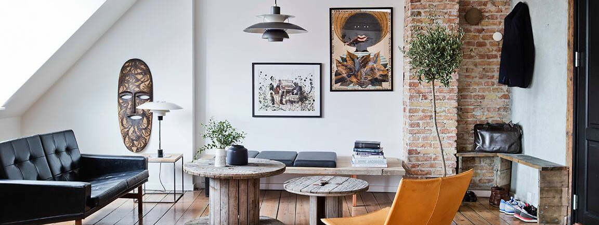

<style>
pre code,  .md:not(.use-csslab) pre code {
  white-space: pre-wrap;
  }
</style>

```{r setup, echo = FALSE, message = FALSE, warning = FALSE}
knitr::opts_chunk$set(comment = NA, 
                      fig.width = 6, 
                      fig.height = 6,
                      fig.align = 'center',
                      echo = FALSE, 
                      eval = FALSE, 
                      warning = FALSE)

options(digits = 3)

# Load packages
library(tidyverse)
library(lubridate)
library(knitr)
library(kableExtra)
library(sjPlot)
```

<p align="center" width="100%">
  
  <br>
  <font style="font-size:10px">from <a href="https://www.airbnb.ca/rooms/1347514/photos/13227297?guests=4&s=4fFl&source_impression_id=p3_1591077094_V6VkyaMzWmptgznT&adults=1">airbnb.ca</a></font>
</p>
 

# {.tabset}

## Überblick

In diesem Practical wirst du nun die Grafiken in deinem Dokument gestalten 
und Bausteine, Text und Tabellen, einfügen.

1. Grafiken formatieren.
3. Datentabellen einfügen und im Detail gestalten.
4. Ergebnisse eines Regressionsmodells einbinden.

## Aufgaben

### A - Setup

1. Öffne dein `TheRBootcamp` R Projekt. Es sollte die Ordner `1_Data`, `2_Assets`, und `3_Markdown` enthalten. 

2. Lade die `airbnb_level_one.Rmd` Datei, das fertige Produkt am Ende des ersten Markdown Practicals. 

3. Zusätzlich lade die Pakete `knitr`, `kableExtra` `sjPlot` im `setup` chunk. 

### B - Präambel: Fussnote einfügen

1. Ergänze eine Fussnote nach dem Texteil 'verfügbarer Daten' `^[Daten wurde heruntergeladen von [insideairbnb.com](http://insideairbnb.com/get-the-data.html)]`

2. `Knitte` das Dokument. Siehst du nun eine Fussnote am Ende des Dokuments?  

### C - Neueinstellungen: Plots

1. Nun geht es darum die Darstellung der Grafiken zu verbessern und Bildunterschriften einzufügen. Setze zunächst das Seitenverhältnis der ersten Grafik auf .5 (`fig.asp = .5`). Knitte das Dokument. Die Grafik sollte nun schmaler sein.

2. Füge `fig.cap = cap` in den Optionen des Chunks der ersten Grafik ein. Dies wird dir ermöglichen gleich die Bildunterschrift im Chunk zu definieren.

3. Am Ende des Grafik Chunks ergänze nun `cap = Abbildung 1. Neueinstellungen pro Monat.`. Knitte das Dokument. Du solltest nun eine Bildunterschrift sehen.

4. Weitere zur nächsten Grafik. Setze das Seitenverhältnis für die zweite Grafik auf .5.

5. Füge nun zunächst `fig.cap = cap` in den Optionen des Chunks der zweiten Grafik ein und dann innerhalb des Chunks `cap = Abbildung 2. Neueinstellungen pro Bezirk.`. 

6. `Knitte` das Dokument. Sieht alles in Ordnung aus?  

### D - Preise: Neuer Texteil

1. Für einen neuen Abschnitt füge `Preis` als Level 3 Header ein.

2. Setze darunter den folgenden Text.

````wrap
Der durchschnittliche Preis der Neueinstellungen beträgt 80.8 €. Im Vergleich zum Vorjahr sind die Preise der Neueinstellungen um 1.7% gestiegen.
````

3. In diesem Text werden die Zahlen nicht berechnet - füge inline Code für den durschschnittlichen Preis aus dem Datensatz `airbnb_1819` direkt im Text ein. Siehe unten.

```R
round(mean(airbnb_1819 %>% pull(Preis)),1)
```

4. Wähle die gleiche Vorgangsweise für die prozentuelle Steigerung der Preise. Verwende folgenden Code für die Berechnung innerhalb des Texts. 

```R
m <- mean(airbnb_1819 %>% filter(year(Erstellungsdatum) == 2019) %>% pull(Preis))/ mean(airbnb_1819 %>% filter(year(Erstellungsdatum) == 2018) %>% pull(Preis)) ; round(m, 3) * 100 - 100
```

5. `Knitte` das Dokument. Sieht alles in Ordnung aus?  

### E - Preise: Neuer Texteil

1. Erstelle eine neue Überschrift, `Einfluss Ausstattung`, als Level 4 Header.

2. Berechne als ersten Schritt in einem eigenem Code Chunk wie sich die verschiedenen Ausstattungsmerkmale (Küche, Wifi, ...) auf die durchschnittlichen Preise auswirken. 

```R
# Vektor mit Ausstattungsmerkmalen
ausstattung_var = c('Küche','Wifi','TV','Kaffeemaschine',
                    'Geschirrspüler','Terrasse_Balkon',
                    'Check_in_24h')

# Bestimme Preise als Funktion der Ausstattungsmerkmale
ausstattung <- airbnb_1819 %>% 
               select(all_of(ausstattung_var), Preis) %>%
               pivot_longer(-Preis,
               names_to = 'Ausstattung',
               values_to = 'Ausstattung_vorhanden') %>% 
              group_by(Ausstattung) %>% 
  summarize(Nicht_vorhanden = mean(Preis[!Ausstattung_vorhanden]),
            Vorhanden = mean(Preis[Ausstattung_vorhanden]),
            Differenz = Vorhanden - Nicht_vorhanden, 
            Prozent_vorhanden = mean(Ausstattung_vorhanden) * 100) %>% 
  arrange(desc(Differenz)) 
```

3. Füge einen neuen Textteil ein.

````wrap
Das Austattungsmerkmal mit dem grössten Unterschied im Preis ist Check_in_24h (72.9), das Austattungsmerkmal mit dem kleinsten Unterschied im Preis ist Küche (-88.9).
````

4. Ersetze den Variablenamen und den numerischen Wert in Klammer (grösster Unterschied im Preis) mit zwei separaten inline Code-Elementen.

```R
ausstattung %>% pull(Ausstattung) %>% first()
ausstattung %>% pull(Differenz) %>% first() %>% round(1)
```

5. Ersetze genauso Variablename und numerischen Wert in Klammer für den kleinsten Unterschied im Preis.

```{R
ausstattung %>% pull(Ausstattung) %>% last()
ausstattung %>% pull(Differenz) %>% last() %>% round(1)
```

6. Der folgenden Textabschnitt beinhaltet eine Schlussfolgerung aus den Ergebnissen der Tabelle. Kennzeichne den Textabschnitt mit &ast;&ast; vor und nach dem ersten Wort und setze ihn damit in fetter Schriftart.

````wrap
Der stark negative Effekt der Küche überrascht, er könnte jedoch durch die Art der Unterkunft moderiert werden, gegeben dass auch Hotels im Angebot enthalten sind.
````

7. `Knitte` das Dokument. Sieht alles in Ordnung aus?  

### F - Preis: Tabelle 1 erzeugen

1. Erstelle einen neuen Code Chunk mit einer Tabelle basierend auf `ausstattung`. Verwende dafür die `kable()` Funktion. Siehe unten.

```R
# Plotte Tabelle mit Austattungsmerkmalen
ausstattung %>% kable(format = 'html')
```

2. Beschränke die Anzahl Nachkommastellen mit `digits = 2` auf zwei.

3. Füge eine Tabellenüberschrift mit `caption = 'Tabelle 1. Austattung und Einfluss auf den Preis'` ein.

4. Passe die Namen der Spalten an, inklusive neuer Zeilenumbrüche mit `<br>`: `col.names = c('', 'Preis<br>Nicht-vorh.', 'Preis<br>vorh.','Differenz','Prozent<br>vorh.')`

5. `Knitte` das Dokument. Du wirst bemerken, dass die Spaltenbeschriftung nicht korrekt übersetzt wird. Verwende als weiteres Argument `escape = FALSE` um dieses Problem zu korrigieren. 

6. Lege die Ausrichtung der Zellen mit `align = "lcccc"` fest. Jeder Buchstabe legt die Ausrichtung für eine Spalte fest. `l` bedeutet left und `c` center.

7. Nun vergrössere die Breite der Spalten in dem du `column_spec()` hinter der `kable()` Funktion verwendest. 

```R
airbnb_18_19 %>% kable(...) %>% column_spec(c(2,3,4,5), width = "1.2in")
```

8. Abschliessend, gestalte die Schrifgrösse der Zellen in Abhängigkeit der Grösse der abgebildeten Zahl. Füge dafür vor der `kable()` Funktion folgenden Code ein und verbinde die beiden Teile mit einer Pipe `%>%`.

```R
airbnb_1819 %>% 
mutate_if(is.numeric, function(x) {
    cell_spec(round(x,1), bold = T, 
              font_size = spec_font_size(x, begin=10, end=16))}) %>% 
kable(...) %>% column_spec(...)
```

9. `Knitte` das Dokument. Sieht alles in Ordnung aus?  

### G - Preise: Text Teil

1. Erstelle eine neue Überschrift, `Regressionsmodell`, als Level 4 Header

2. Verwende den Code unten um eine Regression in der `Preis` durch verschiedenen Ausstattungsmerkmalen und den Status Hotel Ja/Nein vorhergesagt wird. 

```R
# Reduzierter Vektor mit Ausstattungsmerkmalen
ausstattung_var <- c('Küche','TV','Terrasse_Balkon','Check_in_24h')

# Bereit den Datensatz für die Regression vor
ausstattung <- airbnb_1819 %>% 
  mutate(Hotel = Unterkunftsart %in% c('Boutique hotel', 'Hotel')) %>% 
  select(Preis, Hotel, all_of(ausstattung_var)) 

# Rechne Regression des Preises auf Austattungsmerkmale und Hotel
ausstattung_mod <-  ausstattung%>% 
  lm(formula = Preis ~ .)
  
# Bestimme Anteil Hotels in 2018 und 2019
hotel <- airbnb_1819 %>% 
  group_by(year(Erstellungsdatum)) %>% 
  summarize(Anteil = mean(Unterkunftsart %in% c('Boutique hotel', 'Hotel')))   
```

3. Füge nun folgenden Textblock ein.

`````wrap
Die Regression legt nahe, dass Küche, TV und Terrasse oder Balkon den grössten Einfluss auf den Preis in denletztene beiden Jahren hatten.

Der Einfluss der Küche ist gegenüber dem Unterschied in Tabelle 1 gesunken, jedoch nach wie vor signifikant.

Überraschenderweise ist der Effekt eines 24h Check-ins, welcher deskriptiv am grössten ausfiel, nicht signifikant. Dies ist ebenfalls auf den Zusammen zur Unterkunftsart zurückzuführen

Es besteht ein substantieller Unterschied im Preis zwischen Unterkunftsarten. Hotels haben eine um 437.3€ höheren Preis als Unterkünfte die keine Hotels sind.

Der Anteil von Hotels ist von 1.1% im Jahre 2018 auf 1.4% im Jahre 2019 gestiegen. Es liegt nahe, dass der Anstieg im Anteil der Hotels, den Anstieg der Objektpreise verursacht.
`````

4. Lasse dir die Koeffizienten aus dem Regressionsmodell ausgeben und verwende den Code unten um im vierten Absatz (Hotels haben einen um ... höheren Preis) das Ergebnis im Satz zu ersetzen.

```R
coefficients(ausstattung_mod)['HotelTRUE'] %>% round(1)
```

5. Hebe zum Abschluss den 2. ("Überraschenderweise ...") und 4. Absatz ("Der Anteil ...") fett hervor.

6. `Knitte` das Dokument. Sieht alles in Ordnung aus?  

### H - Preise: Regressionstabelle

1. Zeige die Regressionsergebnisse in einer Tablle mit der `tab_model()` Funktion an.

```R
# Tabelle mit Ergebnissen der Regression
tab_model(ausstattung_mod)
```
2. Ersetze die Namen der Koeffizienten in der Tabelle mit dem Argument `pred.labels = c('Achsenabschnitt', names(ausstattung)[-1])`

3. Füge einen neuen Tabellentitel mit dem Argument `title = 'Table 2. Regression des Preises auf die Ausstattung.'` ein. 

4. `Knitte` das Dokument. Sieht alles in Ordnung aus?  


## Datensatz

Der [airbnb.csv](https://raw.githubusercontent.com/therbootcamp/RmR_2020Jun/master/_materials/case/1_Data/airbnb.csv) Datensatz enthält Zahlen zu 9868 Berliner Airbnbs 


|Variable | Beschreibung |
|:-------------|:-------------------------------------|
|Preis| Preis pro Nacht|
 |Erstellungsdatum| Eröffnungsdatum des Airbnbs |
 |Unterkunftsart| Appartement, Loft, House, etc.|
 |Schlafplätze| Anzahl Schlafplätze |
 |Schlafzimmer| Anzahl Schlafzimmer |
 |Badezimmer| Anzahl Badezimmer |
 |Reinigungsgebühr| Reinigungsgebühr |
 |Verfügbarkeit_90Tage| |
 |Viertel| In welchem Viertel befindet sich das Airbnb |
 |Stadtteil| In welchem Stadtteil befindet sich das Airbnb |
 |Breitengrad| Breitengrad|
 |Längengrad| Längengrad |
 |Host_id| Host id |
 |Host_seit| Erfahrung des Hosts |
 |Host_antwortzeit| Host Antwortzeit|
 |Host_antwortrate| Host Antwortrate |
 |Host_superhost| Superhost Ja/Nein |
 |Host_anzahl| Anzahl Gäste |
 |Rating_gesamt| Gesamtrating |
 |Rating_genauigkeit| Genauigkeitsrating |
 |Rating_sauberkeit| Sauberkeitsrating |
 |Rating_checkin| Checkinrating |
 |Rating_kommunikation| Kommunikationsrating |
 |Rating_lage| Lagerating |
 |Rating_wertigkeit| Wertigkeitsrating |
 |Küche| Küche vorhanden TRUE/FALSE |
 |Wifi| WLAN vorhanden TRUE/FALSE |
 |TV| TV vorhanden TRUE/FALSE |
 |Kaffeemaschine| Kaffeemaschine vorhanden TRUE/FALSE|
 |Geschirrspüler| Geschirrspüler vorhanden TRUE/FALSE|
 |Terrasse_Balkon| Terrasse/Balkon vorhanden TRUE/FALSE|
 |Badewanne| Badewanne vorhanden TRUE/FALSE|
 |Check_in_24h| 24h Check-In vorhanden TRUE/FALSE|


## Funktionen

### Paket

|Paket| Installation|
|:------|:------|
|`tidyverse`|`install.packages("tidyverse")`|
|`lubridate`|`install.packages("tidyverse")`|
|`knitr`|`install.packages("knitr")`|
|`sjPlot`|`install.packages("sjPlot")`|
|`kabelExtra`|`install.packages("kableExtra")`|

### Funktionen

| Funktion| Paket | Beschreibung |
|:---|:------|:---------------------------------------------|
| `kable()`|`knitr`|Tibble (Data frame) als Tabelle| 
| `cell_spec()`, `column_spec`|`kableExtra`|Formatiere Zellen und Spalten in `kable`-Tabelle| 
| `tab_model()`|`sjPlot`|Tabelle mit den Ergebnissen statistischer Modelle| 
| `coefficients()`|`stats`|Zeiege Koeffizienten einer Regression| 
| `pivot_longer()`|`tidyr`|Extrahieren eines Vektors| 


## Materialien

- Allgemeiner Einstieg in [**RMarkdown**](https://rmarkdown.rstudio.com/lesson-1.html).
- [**DIE Referenz**](https://bookdown.org/yihui/rmarkdown/) für RMarkdown bis ins letzte Detail.
- [**Rmarkdown**](https://cran.r-project.org/web/packages/rmarkdown/index.html) Dokumentation und Befehlsreferenz.
