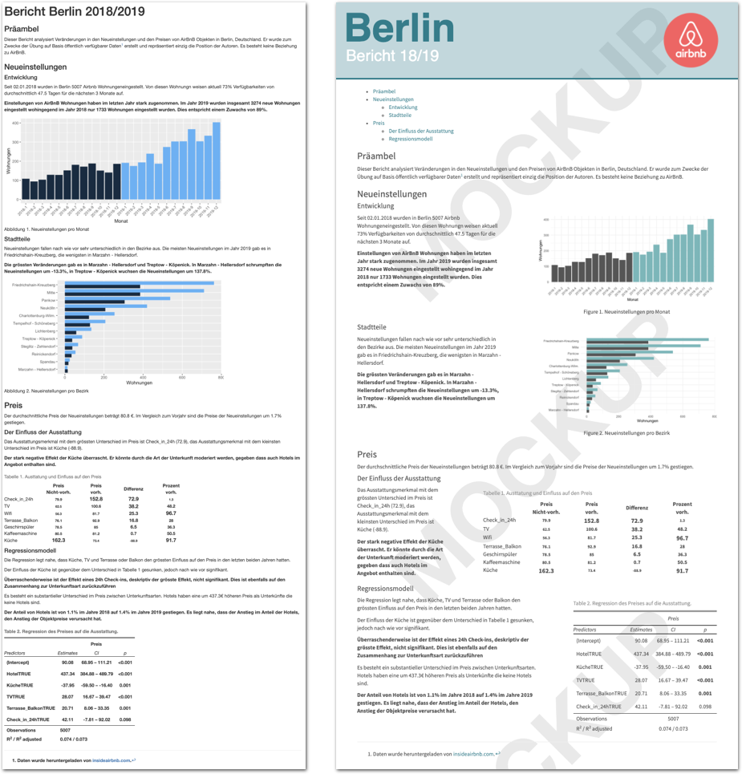
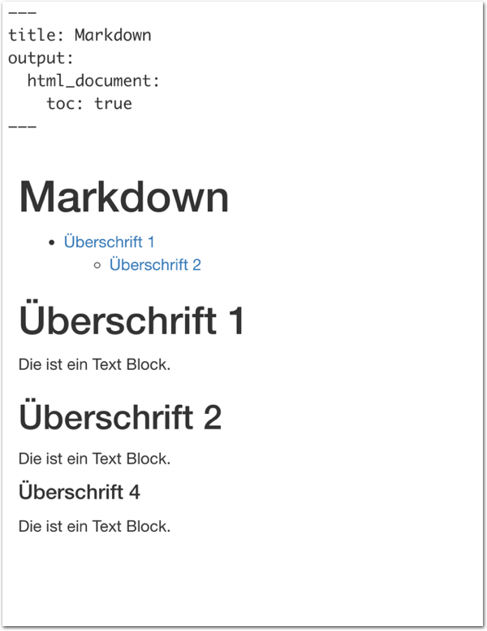
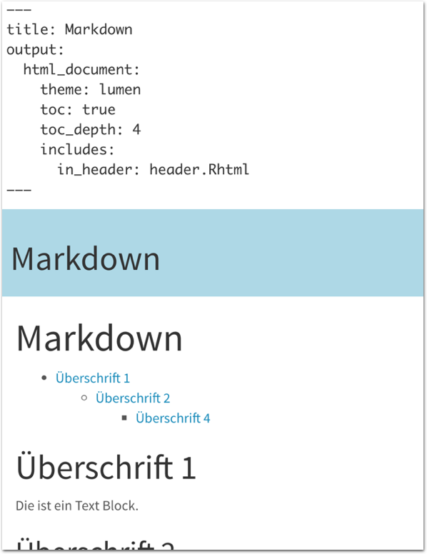
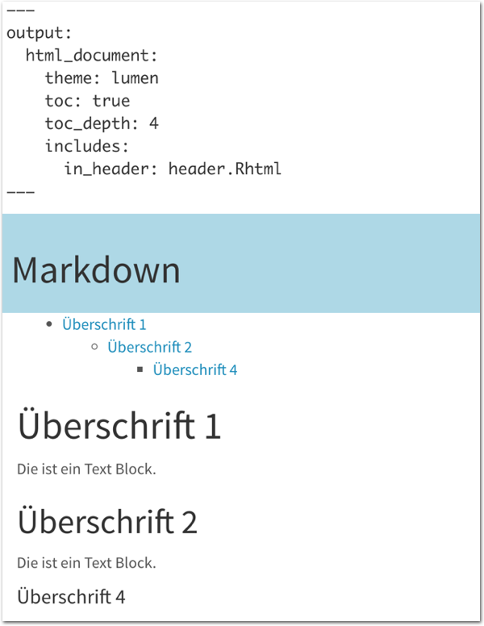
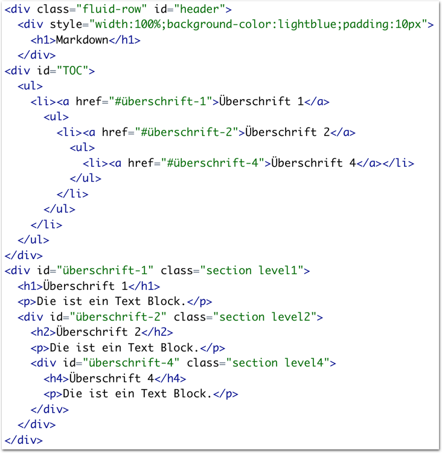
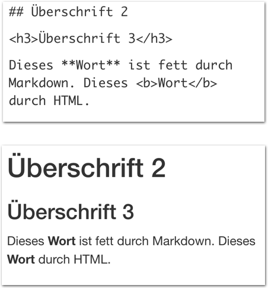
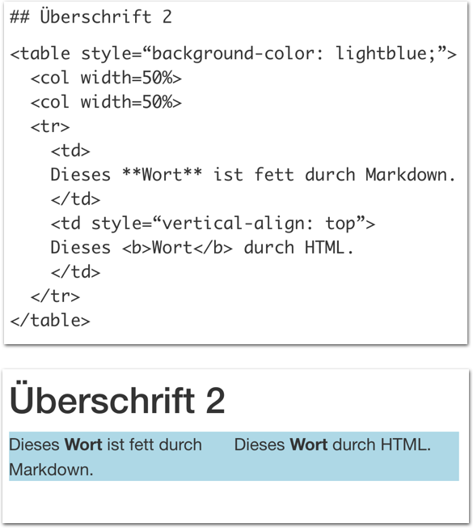

layout: true

<div class="my-footer">
  <span style="text-align:center">
    <span> 
      
    </span>
    <a href="https://therbootcamp.github.io/">
      <span style="padding-left:82px"> 
        <font color="#7E7E7E">
          www.therbootcamp.com
        </font>
      </span>
    </a>
    <a href="https://therbootcamp.github.io/">
      <font color="#7E7E7E">
       Reporting mit R | Februar 2021
      </font>
    </a>
    </span>
  </div> 

---

```{r setup, include=FALSE}
options(htmltools.dir.version = FALSE)
options(width = 110)
options(digits = 4)

# Load packages
require(tidyverse)
require(knitr)

# load color set
source("../../_materials/palette/therbootcamp_palettes.R")

# knitr options
knitr::opts_chunk$set(dpi = 300, 
                      echo = FALSE, 
                      warning = FALSE, 
                      fig.align = 'center', 
                      message= FALSE,
                      comment = NA)
# special print function: avoid if possible
print2 <- function(x, nlines=10,...) {
   cat(head(capture.output(print(x,...)), nlines), sep="\n")}

# load data
airbnb <- read_csv("1_Data/airbnb.csv")

```

.pull-left3[

# Nächste Schritte

<ul>
  <li class="m1"><span>YAML</span></li>
  <ul><br>
    <li><span>Header</span></li>
    <li><span>Inhaltsverzeichnis</span></li>
    <li><span>Themes</span></li>
  </ul><br>
  <li class="m2"><span>Styling</span></li>
  <ul><br>
    <li><span>Grafiken</span></li>
    <li><span>CSS</span></li>
    <li><span>Columns</span></li>
  </ul>
</ul>

]

.pull-right6[

<p align = "center">
  
</p>

]

---

.pull-left4[

# YAML

<ul>
  <li class="m1"><span><b>Y</b>AML <b>A</b>'int <b>M</b>arkup <b>L</b>anguage.<span></li>
  <li class="m2"><span>Erlaubt die Definition der <high>Eigenschaften des Dokuments</high> einschliesslich Inklusionen.<span></li>
</ul>

<table style="cellspacing:0; cellpadding:0; border:none; padding-top:10px" width=100%>
  <col width="40%">
  <col width="60%">
<tr>
  <td bgcolor="white">
    <b>Argument</b>   
  </td>
  <td bgcolor="white">
    <b>Beschreibung</b>
  </td> 
</tr>
<tr>
  <td bgcolor="white">
  <mono>toc</mono> 
  </td>
  <td bgcolor="white">
  <b>T</b>able <b>O</b>f <b>C</b>ontents.
  </td> 
</tr>
<tr>
  <td bgcolor="white">
  <mono>toc_depth</mono> 
  </td>
  <td bgcolor="white">
  <high>Tiefe</high> des <b>T</b>able <b>O</b>f <b>C</b>ontents.
  </td> 
</tr>
<tr>
  <td bgcolor="white">
  <mono>theme</mono> 
  </td>
  <td bgcolor="white">
  <high>Eigenschaften</high> des Textbilds.
  </td> 
</tr>
<tr>
  <td bgcolor="white">
  <mono>includes</mono> 
  </td>
  <td bgcolor="white">
  <high>Ergänzungen</high> vor (<mono>before_body</mono>), nach (<mono>after_body</mono>) <mono>body</mono>, oder <mono>in_header</mono>.
  </td> 
</tr>
</table>

]

.pull-right5[

<br>
<p align = "center">
  
</p>

]


---

.pull-left4[

# YAML

<ul>
  <li class="m1"><span><b>Y</b>AML <b>A</b>'int <b>M</b>arkup <b>L</b>anguage.<span></li>
  <li class="m2"><span>Erlaubt die Definition der <high>Eigenschaften des Dokuments</high> einschliesslich Inklusionen.<span></li>
</ul>

<table style="cellspacing:0; cellpadding:0; border:none; padding-top:10px" width=100%>
  <col width="40%">
  <col width="60%">
<tr>
  <td bgcolor="white">
    <b>Argument</b>   
  </td>
  <td bgcolor="white">
    <b>Beschreibung</b>
  </td> 
</tr>
<tr>
  <td bgcolor="white">
  <mono>toc</mono> 
  </td>
  <td bgcolor="white">
  <b>T</b>able <b>O</b>f <b>C</b>ontents.
  </td> 
</tr>
<tr>
  <td bgcolor="white">
  <mono>toc_depth</mono> 
  </td>
  <td bgcolor="white">
  <high>Tiefe</high> des <b>T</b>able <b>O</b>f <b>C</b>ontents.
  </td> 
</tr>
<tr>
  <td bgcolor="white">
  <mono>theme</mono> 
  </td>
  <td bgcolor="white">
  <high>Eigenschaften</high> des Textbilds.
  </td> 
</tr>
<tr>
  <td bgcolor="white">
  <mono>includes</mono> 
  </td>
  <td bgcolor="white">
  <high>Ergänzungen</high> vor (<mono>before_body</mono>), nach (<mono>after_body</mono>) <mono>body</mono>, oder <mono>in_header</mono>.
  </td> 
</tr>
</table>

]

.pull-right5[

<br>
<p align = "center">
  
</p>

]

---

.pull-left4[

# YAML

<ul>
  <li class="m1"><span><b>Y</b>AML <b>A</b>'int <b>M</b>arkup <b>L</b>anguage.<span></li>
  <li class="m2"><span>Erlaubt die Definition der <high>Eigenschaften des Dokuments</high> einschliesslich Inklusionen.<span></li>
</ul>

<table style="cellspacing:0; cellpadding:0; border:none; padding-top:10px" width=100%>
  <col width="40%">
  <col width="60%">
<tr>
  <td bgcolor="white">
    <b>Argument</b>   
  </td>
  <td bgcolor="white">
    <b>Beschreibung</b>
  </td> 
</tr>
<tr>
  <td bgcolor="white">
  <mono>toc</mono> 
  </td>
  <td bgcolor="white">
  <b>T</b>able <b>O</b>f <b>C</b>ontents.
  </td> 
</tr>
<tr>
  <td bgcolor="white">
  <mono>toc_depth</mono> 
  </td>
  <td bgcolor="white">
  <high>Tiefe</high> des <b>T</b>able <b>O</b>f <b>C</b>ontents.
  </td> 
</tr>
<tr>
  <td bgcolor="white">
  <mono>theme</mono> 
  </td>
  <td bgcolor="white">
  <high>Eigenschaften</high> des Textbilds.
  </td> 
</tr>
<tr>
  <td bgcolor="white">
  <mono>includes</mono> 
  </td>
  <td bgcolor="white">
  <high>Ergänzungen</high> vor (<mono>before_body</mono>), nach (<mono>after_body</mono>) <mono>body</mono>, oder <mono>in_header</mono>.
  </td> 
</tr>
</table>

]

.pull-right5[

<br>
<p align = "center">
  
</p>

]

---

.pull-left4[

# YAML

<ul>
  <li class="m1"><span><b>Y</b>AML <b>A</b>'int <b>M</b>arkup <b>L</b>anguage.<span></li>
  <li class="m2"><span>Erlaubt die Definition der <high>Eigenschaften des Dokuments</high> einschliesslich Inklusionen.<span></li>
</ul>

<table style="cellspacing:0; cellpadding:0; border:none; padding-top:10px" width=100%>
  <col width="40%">
  <col width="60%">
<tr>
  <td bgcolor="white">
    <b>Argument</b>   
  </td>
  <td bgcolor="white">
    <b>Beschreibung</b>
  </td> 
</tr>
<tr>
  <td bgcolor="white">
  <mono>toc</mono> 
  </td>
  <td bgcolor="white">
  <b>T</b>able <b>O</b>f <b>C</b>ontents.
  </td> 
</tr>
<tr>
  <td bgcolor="white">
  <mono>toc_depth</mono> 
  </td>
  <td bgcolor="white">
  <high>Tiefe</high> des <b>T</b>able <b>O</b>f <b>C</b>ontents.
  </td> 
</tr>
<tr>
  <td bgcolor="white">
  <mono>theme</mono> 
  </td>
  <td bgcolor="white">
  <high>Eigenschaften</high> des Textbilds.
  </td> 
</tr>
<tr>
  <td bgcolor="white">
  <mono>includes</mono> 
  </td>
  <td bgcolor="white">
  <high>Ergänzungen</high> vor (<mono>before_body</mono>), nach (<mono>after_body</mono>) <mono>body</mono>, oder <mono>in_header</mono>.
  </td> 
</tr>
</table>

]

.pull-right5[

<br>
<p align = "center">
  
</p>

]

---

.pull-left4[

# YAML

<ul>
  <li class="m1"><span><b>Y</b>AML <b>A</b>'int <b>M</b>arkup <b>L</b>anguage.<span></li>
  <li class="m2"><span>Erlaubt die Definition der <high>Eigenschaften des Dokuments</high> einschliesslich Inklusionen.<span></li>
</ul>

<table style="cellspacing:0; cellpadding:0; border:none; padding-top:10px" width=100%>
  <col width="40%">
  <col width="60%">
<tr>
  <td bgcolor="white">
    <b>Argument</b>   
  </td>
  <td bgcolor="white">
    <b>Beschreibung</b>
  </td> 
</tr>
<tr>
  <td bgcolor="white">
  <mono>toc</mono> 
  </td>
  <td bgcolor="white">
  <b>T</b>able <b>O</b>f <b>C</b>ontents.
  </td> 
</tr>
<tr>
  <td bgcolor="white">
  <mono>toc_depth</mono> 
  </td>
  <td bgcolor="white">
  <high>Tiefe</high> des <b>T</b>able <b>O</b>f <b>C</b>ontents.
  </td> 
</tr>
<tr>
  <td bgcolor="white">
  <mono>theme</mono> 
  </td>
  <td bgcolor="white">
  <high>Eigenschaften</high> des Textbilds.
  </td> 
</tr>
<tr>
  <td bgcolor="white">
  <mono>includes</mono> 
  </td>
  <td bgcolor="white">
  <high>Ergänzungen</high> vor (<mono>before_body</mono>), nach (<mono>after_body</mono>) <mono>body</mono>, oder <mono>in_header</mono>.
  </td> 
</tr>
</table>

]

.pull-right5[

<br>
<p align = "center">
  
</p>

]

---

.pull-left4[

# YAML

<ul>
  <li class="m1"><span><b>Y</b>AML <b>A</b>'int <b>M</b>arkup <b>L</b>anguage.<span></li>
  <li class="m2"><span>Erlaubt die Definition der <high>Eigenschaften des Dokuments</high> einschliesslich Inklusionen.<span></li>
</ul>

<table style="cellspacing:0; cellpadding:0; border:none; padding-top:10px" width=100%>
  <col width="40%">
  <col width="60%">
<tr>
  <td bgcolor="white">
    <b>Argument</b>   
  </td>
  <td bgcolor="white">
    <b>Beschreibung</b>
  </td> 
</tr>
<tr>
  <td bgcolor="white">
  <mono>toc</mono> 
  </td>
  <td bgcolor="white">
  <b>T</b>able <b>O</b>f <b>C</b>ontents.
  </td> 
</tr>
<tr>
  <td bgcolor="white">
  <mono>toc_depth</mono> 
  </td>
  <td bgcolor="white">
  <high>Tiefe</high> des <b>T</b>able <b>O</b>f <b>C</b>ontents.
  </td> 
</tr>
<tr>
  <td bgcolor="white">
  <mono>theme</mono> 
  </td>
  <td bgcolor="white">
  <high>Eigenschaften</high> des Textbilds.
  </td> 
</tr>
<tr>
  <td bgcolor="white">
  <mono>includes</mono> 
  </td>
  <td bgcolor="white">
  <high>Ergänzungen</high> vor (<mono>before_body</mono>), nach (<mono>after_body</mono>) <mono>body</mono>, oder <mono>in_header</mono>.
  </td> 
</tr>
</table>

]

.pull-right5[

<br>
<p align = "center">
  
</p>

]

---

.pull-left3[

# HTML


<ul>
  <li class="m1"><span><b>H</b>ypertext <b>M</b>arkup <b>L</b>anguage ermöglicht die Organization von Text und Inhalten mittels <high>HTML-Tags<high>.</span></li> 
  </ul>

<table style="cellspacing:0; cellpadding:0; border:none; padding-top:10px" width=100%>
  <col width="40%">
  <col width="60%">
<tr>
  <td bgcolor="white">
    <b>Tag</b>   
  </td>
  <td bgcolor="white">
    <b>Beschreibung</b>
  </td> 
</tr>
<tr>
  <td bgcolor="white">
  <mono>&lt;h1&gt;, &lt;h2&gt,...</mono> </td>
  <td bgcolor="white">
  <high>Überschrift</high> Level 1, 2,...
  </td> 
</tr>
<tr>
  <td bgcolor="white">
  <mono>&lt;br&gt;</mono>
  </td>
  <td bgcolor="white">
   Neue <high>Zeile</high>.
  </td> 
</tr>
<tr>
  <td bgcolor="white">
  <mono>&lt;b&gt;, &lt;i&gt;, &lt;u&gt;</mono>
  </td>
  <td bgcolor="white">
  <high>Fett, Kursiv, Unterstrichen.</high>
  </td> 
</tr>
<tr>
  <td bgcolor="white">
  <mono>&lt;div&gt;, &lt;p&gt;</mono> 
  </td>
  <td bgcolor="white">
  <high>Abschnitt, Textabschnitt.</high>
  </td> 
</tr>
<tr>
  <td bgcolor="white">
  <mono>&lt;table&gt;</mono> 
  </td>
  <td bgcolor="white">
  <high>Tabelle, Spalten.</high>
  </td> 
</tr>
</table>

]

.pull-right6[

<br>
<p align = "center">
  
</p>

]

---

.pull-left3[

# HTML


<ul>
  <li class="m1"><span><b>H</b>ypertext <b>M</b>arkup <b>L</b>anguage ermöglicht die Organization von Text und Inhalten mittels <high>HTML-Tags<high>.</span></li> 
  </ul>

<table style="cellspacing:0; cellpadding:0; border:none; padding-top:10px" width=100%>
  <col width="40%">
  <col width="60%">
<tr>
  <td bgcolor="white">
    <b>Tag</b>   
  </td>
  <td bgcolor="white">
    <b>Beschreibung</b>
  </td> 
</tr>
<tr>
  <td bgcolor="white">
  <mono>&lt;h1&gt;, &lt;h2&gt,...</mono> </td>
  <td bgcolor="white">
  <high>Überschrift</high> Level 1, 2,...
  </td> 
</tr>
<tr>
  <td bgcolor="white">
  <mono>&lt;br&gt;</mono>
  </td>
  <td bgcolor="white">
   Neue <high>Zeile</high>.
  </td> 
</tr>
<tr>
  <td bgcolor="white">
  <mono>&lt;b&gt;, &lt;i&gt;, &lt;u&gt;</mono>
  </td>
  <td bgcolor="white">
  <high>Fett, Kursiv, Unterstrichen.</high>
  </td> 
</tr>
<tr>
  <td bgcolor="white">
  <mono>&lt;div&gt;, &lt;p&gt;</mono> 
  </td>
  <td bgcolor="white">
  <high>Abschnitt, Textabschnitt.</high>
  </td> 
</tr>
<tr>
  <td bgcolor="white">
  <mono>&lt;table&gt;</mono> 
  </td>
  <td bgcolor="white">
  <high>Tabelle, Spalten.</high>
  </td> 
</tr>
</table>

]

.pull-right6[

<br><br><br>
<p align = "center">
  
</p>

]


---

.pull-left3[

# HTML


<ul>
  <li class="m1"><span><b>H</b>ypertext <b>M</b>arkup <b>L</b>anguage ermöglicht die Organization von Text und Inhalten mittels <high>HTML-Tags<high>.</span></li> 
  </ul>

<table style="cellspacing:0; cellpadding:0; border:none; padding-top:10px" width=100%>
  <col width="40%">
  <col width="60%">
<tr>
  <td bgcolor="white">
    <b>Tag</b>   
  </td>
  <td bgcolor="white">
    <b>Beschreibung</b>
  </td> 
</tr>
<tr>
  <td bgcolor="white">
  <mono>&lt;h1&gt;, &lt;h2&gt,...</mono> </td>
  <td bgcolor="white">
  <high>Überschrift</high> Level 1, 2,...
  </td> 
</tr>
<tr>
  <td bgcolor="white">
  <mono>&lt;br&gt;</mono>
  </td>
  <td bgcolor="white">
   Neue <high>Zeile</high>.
  </td> 
</tr>
<tr>
  <td bgcolor="white">
  <mono>&lt;b&gt;, &lt;i&gt;, &lt;u&gt;</mono>
  </td>
  <td bgcolor="white">
  <high>Fett, Kursiv, Unterstrichen.</high>
  </td> 
</tr>
<tr>
  <td bgcolor="white">
  <mono>&lt;div&gt;, &lt;p&gt;</mono> 
  </td>
  <td bgcolor="white">
  <high>Abschnitt, Textabschnitt.</high>
  </td> 
</tr>
<tr>
  <td bgcolor="white">
  <mono>&lt;table&gt;</mono> 
  </td>
  <td bgcolor="white">
  <high>Tabelle, Spalten.</high>
  </td> 
</tr>
</table>

]

.pull-right6[

<br><br>
<p align = "center">
  
</p>

]


---

.pull-left3[

# HTML


<ul>
  <li class="m1"><span><b>H</b>ypertext <b>M</b>arkup <b>L</b>anguage ermöglicht die Organization von Text und Inhalten mittels <high>HTML-Tags<high>.</span></li> 
  </ul>

<table style="cellspacing:0; cellpadding:0; border:none; padding-top:10px" width=100%>
  <col width="40%">
  <col width="60%">
<tr>
  <td bgcolor="white">
    <b>Tag</b>   
  </td>
  <td bgcolor="white">
    <b>Beschreibung</b>
  </td> 
</tr>
<tr>
  <td bgcolor="white">
  <mono>&lt;h1&gt;, &lt;h2&gt,...</mono> </td>
  <td bgcolor="white">
  <high>Überschrift</high> Level 1, 2,...
  </td> 
</tr>
<tr>
  <td bgcolor="white">
  <mono>&lt;br&gt;</mono>
  </td>
  <td bgcolor="white">
   Neue <high>Zeile</high>.
  </td> 
</tr>
<tr>
  <td bgcolor="white">
  <mono>&lt;b&gt;, &lt;i&gt;, &lt;u&gt;</mono>
  </td>
  <td bgcolor="white">
  <high>Fett, Kursiv, Unterstrichen.</high>
  </td> 
</tr>
<tr>
  <td bgcolor="white">
  <mono>&lt;div&gt;, &lt;p&gt;</mono> 
  </td>
  <td bgcolor="white">
  <high>Abschnitt, Textabschnitt.</high>
  </td> 
</tr>
<tr>
  <td bgcolor="white">
  <mono>&lt;table&gt;</mono> 
  </td>
  <td bgcolor="white">
  <high>Tabelle, Spalten.</high>
  </td> 
</tr>
</table>

]

.pull-right6[

<br><br>
<p align = "center">
  
</p>

]

---

.pull-left3[

# HTML


<ul>
  <li class="m1"><span><b>H</b>ypertext <b>M</b>arkup <b>L</b>anguage ermöglicht die Organization von Text und Inhalten mittels <high>HTML-Tags<high>.</span></li> 
  </ul>

<table style="cellspacing:0; cellpadding:0; border:none; padding-top:10px" width=100%>
  <col width="40%">
  <col width="60%">
<tr>
  <td bgcolor="white">
    <b>Tag</b>   
  </td>
  <td bgcolor="white">
    <b>Beschreibung</b>
  </td> 
</tr>
<tr>
  <td bgcolor="white">
  <mono>&lt;h1&gt;, &lt;h2&gt,...</mono> </td>
  <td bgcolor="white">
  <high>Überschrift</high> Level 1, 2,...
  </td> 
</tr>
<tr>
  <td bgcolor="white">
  <mono>&lt;br&gt;</mono>
  </td>
  <td bgcolor="white">
   Neue <high>Zeile</high>.
  </td> 
</tr>
<tr>
  <td bgcolor="white">
  <mono>&lt;b&gt;, &lt;i&gt;, &lt;u&gt;</mono>
  </td>
  <td bgcolor="white">
  <high>Fett, Kursiv, Unterstrichen.</high>
  </td> 
</tr>
<tr>
  <td bgcolor="white">
  <mono>&lt;div&gt;, &lt;p&gt;</mono> 
  </td>
  <td bgcolor="white">
  <high>Abschnitt, Textabschnitt.</high>
  </td> 
</tr>
<tr>
  <td bgcolor="white">
  <mono>&lt;table&gt;</mono> 
  </td>
  <td bgcolor="white">
  <high>Tabelle, Spalten.</high>
  </td> 
</tr>
</table>

]

.pull-right6[

<br><br>
<p align = "center">
  
</p>

]

---

.pull-left3[

# CSS

<ul>
  <li class="m1"><span>Mit <b>C</b>ascading <b>S</b>tyle <b>S</b>sheets können alle <high>ästhetischen Charakteristika</high> von <high>HTML</high> Dokumenten über eine externe Datei bestimmt werden.</span></li>
  <li class="m2"><span>CSS erlaubt komplexe <high>Vererbungen des Stils</high> zwischen HTML Tags.</span></li> 
</ul>

]

.pull-right6[

<br><br>
<p align = "center">
  
</p>

]

---


# Grafiken

.pull-left3[

<ul>
  <li class="m1"><span>Die Gestaltung des Berichts beinhaltet auch die <high>Gestaltung der Abbildungen</high>.</span></li> 
  <li class="m2"><span>Im <mono>ggplot2</mono> Pakets lässt sich die Gestaltung von Grafiken durch <mono>theme</mono>s bestimmen.</span></li>
  <li class="m2"><span>Mit etwas Kreativität lassen sich ebenfalls die <high>Default-Farben</high> bestimmen.</span></li> 
</ul>

]

.pull-right65[

```{r include =F}
# Lade Pakete
library(tidyverse)
library(knitr)
library(sjPlot)
library(kableExtra)
library(lubridate)

# Lade Daten
airbnb_1819 <- read_csv('1_Data/airbnb.csv') %>% 
  filter(Erstellungsdatum > "2018-01-01", 
         Erstellungsdatum < "2019-12-31")
```


```{r eval = TRUE, echo  =TRUE, message = F, warning = F}

# Ändere Thema zu minimal
theme_set(theme_minimal())
theme_update(panel.background = 
             element_rect(fill = "transparent",
                          colour = NA),
             plot.background = 
             element_rect(fill = "transparent",
                          colour = NA))

# Setze defaults in ggplot
ggplot <- function(...) {
 ggplot2::ggplot(...) + 
  scale_fill_gradientn(colors = c('#555555', '#6BB7B9')) + 
  scale_colour_gradientn(colors = c('#555555', '#6BB7B9'))
  }

```


</p>

]

---


# Grafiken

.pull-left3[

<ul>
  <li class="m1"><span>Die Gestaltung des Berichts beinhaltet auch die <high>Gestaltung der Abbildungen</high>.</span></li> 
  <li class="m2"><span>Im <mono>ggplot2</mono> Pakets lässt sich die Gestaltung von Grafiken durch <mono>theme</mono>s bestimmen.</span></li>
  <li class="m2"><span>Mit etwas Kreativität lassen sich ebenfalls die <high>Default-Farben</high> bestimmen.</span></li> 
</ul>

]

.pull-right6[


```{r eval = TRUE, echo  =FALSE, message = F, warning = F}

airbnb_plot <- ggplot(airbnb_1819 %>% 
         group_by(Jahr = year(Erstellungsdatum), month = month(Erstellungsdatum)) %>% 
         summarize(
           Monat = forcats::as_factor(paste(first(Jahr), first(month), sep = '-')),
           Wohnungen = n()), 
       aes(x = Monat, y = Wohnungen,fill = Jahr)) + 
  geom_bar(stat='identity', position='dodge') + 
  theme(legend.position = 'none',
        axis.text.x = element_text(angle = 45, hjust = 1))
```

```{r,echo=T, fig.width=4, fig.height=4, fig.asp = .65}
airbnb_plot
```

]

---

class: middle, center

<h1><a href="https://therbootcamp.github.io/RmR_2021Feb/_sessions/Markdown3/Markdown3_practical.html">Practical</a></h1>

