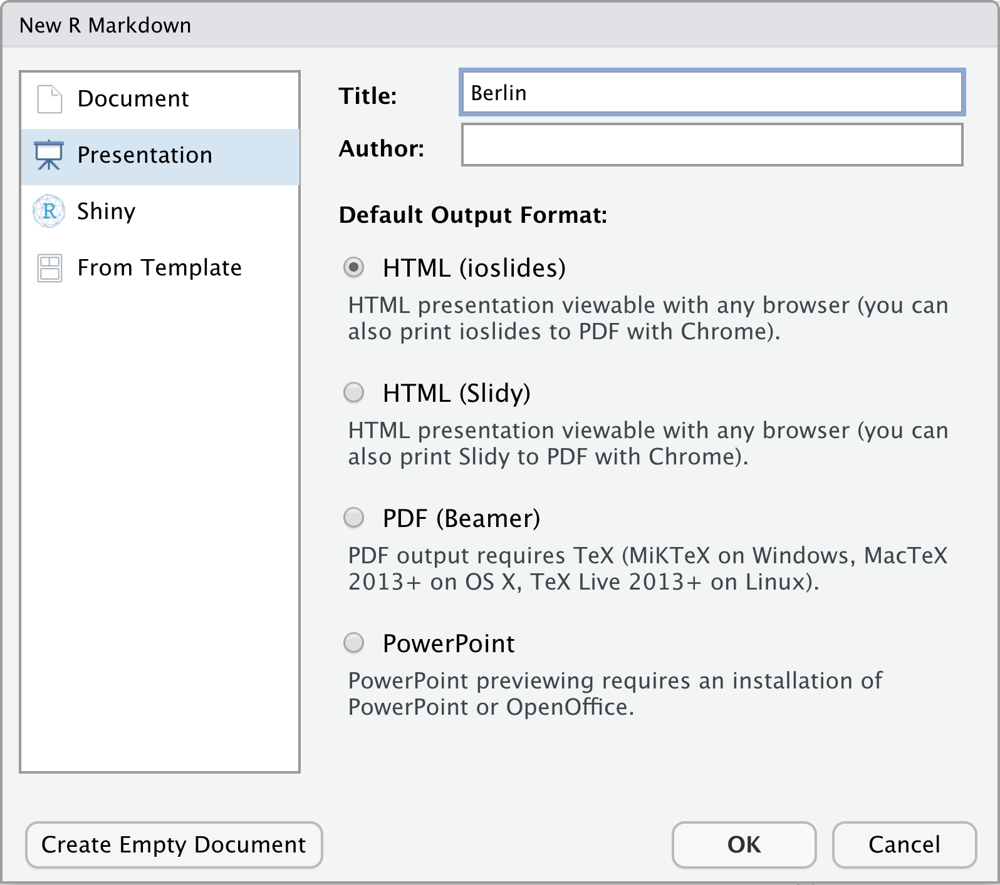

```{r setup, include  = FALSE}
knitr::opts_chunk$set(comment = NA, 
                      fig.width = 6, 
                      fig.height = 6,
                      fig.align = 'center',
                      echo = FALSE, 
                      eval = FALSE, 
                      warning = FALSE)

options(digits = 3)

# Load packages
library(tidyverse)
```

<p align="center" width="100%">
  
  <br>
  <font style="font-size:10px">from <a href="https://dvisiondesign.net/2019/09/25/what-does-design-mean/">dvisiondesign.net</a></font>
</p>


# {.tabset}

## Überblick

In diesem Practical wirst aus deinem fertigen HTML RMarkdown Dokument eine Präsentation erstellen. 

Am Ende des Practicals kann du: 

1. Eine HTML Präsentation mit `ioslides` erstellen und Inhalte mit RMarkdown Code einfügen.
2. Ein Logo einfügen und das Layout der Präsentation anpassen.
3. HTML Tags und CSS für die Feinjustierung der Slides verwenden.

## Aufgaben

### A - Setup

1. Öffne dein `TheRBootcamp` R Projekt. Es sollte die Ordner `1_Data`, `2_Assets`, und `3_Markdown` enthalten. 

2. Öffne ein neues RMarkdown Skript und wähle das Presentation - Template "HTML" aus (siehe screenshot unten).

<p align="center">
  
</p>

3. Trage als Titel `Berlin` ein und drücke OK.

4. Lösche alles unterhalb des `setup` Chunks.

5. Speichere das neue Markdown Skript unter dem Namen `presentation_practical.Rmd` im `3_Markdown` Ordner ab.

### B - YAML

1. Entferne die `author:` und `date:` Angaben aus dem YAML header

2. Bearbeite nun den YAML Header um das Dokument allgemein anzupassen. Füge zunächst unter `title: Berlin`, in einer neuen Zeilte, einen Untertitel ein. Knitte das Dokument. Siehst du den Untertitel?

```R
subtitle: "Bericht: 18/19"
```

3. Damit das Logo automatisch auf der Titelslide und in der Fusszeile jedes Slides angezeigt wird, ergänze zunächst einen Doppelpunkt hinter `ioslides` und dann darunter, eine Ebene weiter eingerückt, die Zeile unten, welche den Pfad zum Logo dem YAML Header bereitstellt. Knitte das Dokument und schaue wie R das Logo einbindet.

```R
logo: ../2_Assets/airbnb.png
```

4. Abschliessend füge auf der selben Ebene wie das Logo die Zeile unten hinzu, welche dem YAML header den Pfad zu einer CSS Datei bereitstellt um weitere Details der Darstellung (Schrift, genaue Position der Komponenten, etc.) zu bestimmen. Einige der Änderungen betreffen Bestandteile der Slides, die erst in späteren Abschnitten erstellt werden.

```R
css: ../2_Assets/airbnb_presentation.css
```

5. Achte auf die korrekten Einrückungen! Der YAML Header sollte so aussehen:

```R
---
title: "Berlin"
subtitle: "Bericht 18/19"
output: 
  ioslides_presentation:
    logo: ../2_Assets/airbnb.png
    css: ../2_Assets/airbnb_presentation.css
---
```

6. Knitte das Dokument. Es sollte ein, in den AirBnB Farben gestalteter Titelslide angezeigt werden, mit rote, AirBnB Logo. 

### C - Setup chunk

Nun wirst du im `Setup` Chunk die notwendigen Pakete laden, Daten laden und verschiedenen Einstellungen vornehmen.

1. Lade die Pakete `tidyverse`, `lubridate`, `sjPlot`, `knitr` und `kableExtra`

2. Inkludiere im Setup-Chunk den folgenden Code um die AirBnB Daten zu laden und Auf den Zeitraum 2018-2019 zu limitieren.

```R
# Lade Daten
airbnb_1819 <- read_csv('../1_Data/airbnb.csv') %>% 
  filter(Erstellungsdatum > "2018-01-01", 
         Erstellungsdatum < "2019-12-31")
```

3. Ergänze weiterhin folgenden Code um die Grafikeinstellungen hinsichtlich `ggplot`, wie im gestrigen Dokument, anzupassen.

```R
# Ändere Thema zu minimal
theme_set(theme_minimal())
theme_update(panel.background = element_rect(fill = "transparent", colour = NA),
             plot.background = element_rect(fill = "transparent", colour = NA),
             axis.title.x = element_text(size = 16), 
             text = element_text(size=19))
             
# Setze defaults in ggplot
ggplot <- function(...) ggplot2::ggplot(...) + 
  scale_fill_gradientn(colors = c('#555555','#6BB7B9')) + 
  scale_colour_gradientn(colors = c('#555555','#6BB7B9'))
```

### D - Slides erstellen

1. Füge nach dem `setup` Chunk in einer neuen Zeile `# Neueinstellungen` ein. Damit erstellst du deine erste Zwischenfolie mit grauem Hintergrund die den Abschnitt einleitet.

2. Knitte das Dokument. Nach dem Titelslide sollte es jetzt einen 2. Slide mit dem Titel Neueinstellungen geben. 

3. In die nächste Zeile füge in einer neuen Zeile "## Entwicklung" ein, was einen ersten Slide mit Inhalt beginnt.

4. Füge darunter den folgenden Satz mit inline Code in der nächsten Zeile ein:

<pre class="r">
  <code class="hljs">
Seit &grave;&#114; strftime(min(airbnb_1819$Erstellungsdatum), "%d.%m.%Y")&grave; wurden in Berlin:
  </code>
</pre>

5. In einer Liste mit Bullet Points ergänze die folgenden, zusammengefassten Informationen. Das `-` ist Markup um eine Liste zu erstellen, also in diesem Fall Bullet Points. Knitte das Dokument. Tauchen die Bullets als Liste auf? 

<pre class="r">
  <code class="hljs">
- &grave;r nrow(airbnb_1819)&grave; Airbnb Wohnungen eingestellt
- &grave;r round(mean(airbnb_1819$Verfügbarkeit_90Tage > 0) * 100)&grave;% haben Verfügbarkeiten von durchschnittlich&grave round(mean(airbnb_1819$Verfügbarkeit_90Tage[airbnb_1819$Verfügbarkeit_90Tage>0]),1)&grave; Tagen
- 2019 wurden insgesamt &grave;r n_2019 = sum(year(airbnb_1819$Erstellungsdatum) == 2019); n_2019&grave; neue Wohnungen eingestellt
- 2018 nur &grave;r n_2018 = sum(year(airbnb_1819$Erstellungsdatum) == 2018); n_2018&grave Wohnungen eingestellt
- Zuwachs: &grave;r (round(n_2019/n_2018, 2) - 1)*100&grave;%
  </code>
</pre>

6. Ergänze nun vor jedem einzelnen Bullet ein grösser als Zeichen, d.h. vor jeder Zeile sollte `>-` stehen. Damit tauchen die einzelnen Bullets gestaffelt nacheinander auf. 

7. Knitte das Dokument. Sind die Bullets nun gestaffelt?

### E - Grafiken einbinden

1. Füge einen neuen Slide mit dem Titel "Entwicklung" ein. Verwende zwei `#`.

2. Auf diesem Slide soll die erste Grafik abgebildet werden. Füge dafür einen Code-Chunk mit der Grafik über die Neueinstellungen pro Monat ein.

```R
# Plotte Häufigkeiten
ggplot(airbnb_1819 %>% 
         group_by(Jahr = year(Erstellungsdatum), 
                  Monat_tmp = month(Erstellungsdatum)) %>% 
         summarize(
           Monat = as_factor(paste(first(Jahr), first(Monat_tmp), sep = '-')),
           Wohnungen = n()), 
       aes(x = Monat, y = Wohnungen, fill = Jahr)) + 
  geom_bar(stat = 'identity', position = 'dodge') + 
  theme(legend.position = 'none',
        axis.text.x = element_text(angle = 45, hjust = 1)) 

# Ergänze caption
cap = "<center>Abbildung 1. Neueinstellungen pro Monat</center>"
```

3. Ergänze in den chunk Optionen `fig.cap = cap` damit die Bildunterschrift angezeigt wird.

4. `Knitte` das Dokument. Enthält Slide 4/4 die Abbilding 1?

### F - Slides über die Stadtteile

1. Füge einen neuen slide mit dem Titel "Stadtteile" ein (zwei `#`).

2. In einem Code-Chunk inkludiere nun die folgenden Berechnungen. 

```R
# Berechne Häufigkeiten über die Bezirke
stadtteile <- airbnb_1819 %>% 
         group_by(Stadtteil, 
                  Jahr = year(Erstellungsdatum)) %>% 
         summarize(Wohnungen = n()) %>% 
  ungroup() %>% 
  arrange(desc(Jahr), Wohnungen) %>% 
  mutate(Stadtteil = as_factor(Stadtteil))

# Veränderung über die Stadtteile
veränderung = stadtteile %>% 
  group_by(Stadtteil) %>% 
  summarize(veränderung = (100 * (Wohnungen[Jahr == 2019]/Wohnungen[Jahr == 2018] - 1)) %>% round(1))

# Geringsten Veränderung
min_veränderung = veränderung %>% 
  slice(which.min(veränderung)) %>% 
  pull(veränderung)

# Stadteil mit der geringsten Veränderung
min_stadtteil = veränderung %>% 
  slice(which.min(veränderung)) %>% 
  pull(Stadtteil)

# Grösste Veränderung
max_veränderung = veränderung %>% 
  slice(which.max(veränderung)) %>% 
  pull(veränderung)

# Stadteil mit der grössten Veränderung
max_stadtteil = veränderung %>% 
  slice(which.max(veränderung)) %>% 
  pull(Stadtteil)
```

3. Jetzt füge die folgende Liste mit Bullet Points als Inhalt für den Slide ein.

<pre class="r">
  <code class="hljs">
> - Meisten Neueinstellungen: &grave;r stadtteile %>% filter(Jahr == 2019) %>% pull(Stadtteil) %>% last()&grave;
> - Wenigste Neueinstellungen:  &grave;r stadtteile %>% filter(Jahr == 2019) %>% pull(Stadtteil) %>% first()&grave;
> - Grössten Reduktion mit  &grave;r min_veränderung&grave;% in &grave;r min_stadtteil&grave; 
> - Grösster Zuwachs mit &grave;r max_veränderung&grave;% in &grave;r max_stadtteil&grave; 
  </code>
</pre>

4. Als nächstes kreiere einen neuen Slide mit dem Titel "Stadtteile".

5. Darunter setze folgenden Code für die 2. Grafik in dein Markdown Dokument.

```R
# Plotte Häufigkeieten der Stadtteile
ggplot(stadtteile, 
       aes(y = Stadtteil, x = Wohnungen, group = Jahr, fill = Jahr)) + 
  geom_bar(stat = 'identity', position = 'dodge') + 
  theme(legend.position = 'none') + labs(y='')

# Ergänze caption
cap = "<center>Figure 2. Neueinstellungen pro Bezirk</center>"
```

6. `Knitte` das Dokument. Werden die 2. Grafik und die Bullets korrekt angezeigt?

### G - Tabelle und Regressionsergebnissen

1. Erstelle einen neuen Abschnitt "Preis" (ein `#`) und einen neuen Slide "Einfluss der Ausstattung" (zwei `##`) .

2. Füge einen Chunk mit dem folgenden Code zur Berechnung der Ausstattungsmerkmale ein.

```R
# Vector mit Ausstatttungsmerkmalen
ausstattung_var <- c('Küche','Wifi','TV','Kaffeemaschine',
                    'Geschirrspüler','Terrasse_Balkon',
                    'Check_in_24h')

# Bestimme Preise als Funktion der Ausstatttungsmerkmale
ausstattung <- airbnb_1819 %>% 
  select(all_of(ausstattung_var), Preis) %>%
  pivot_longer(-Preis,
             names_to = 'Ausstattung',
             values_to = 'Ausstattung_vorhanden') %>% 
  group_by(Ausstattung) %>% 
  summarize(Nicht_vorhanden = mean(Preis[!Ausstattung_vorhanden]),
            Vorhanden = mean(Preis[Ausstattung_vorhanden]),
            Differenz = Vorhanden - Nicht_vorhanden, 
            Prozent_vorhanden = mean(Ausstattung_vorhanden) * 100) %>% 
  arrange(desc(Differenz)) 
```

3. Erstelle die folgende Liste gestaffelter Bulletpoints. Dann knitte die Slides. Bullets korrekt angezeigt? 

<pre class="r">
  <code class="hljs">
> - Durchschnittliche Preis der Neueinstellungen &grave;r round(mean(airbnb_1819 %>% pull(Preis)),1)&grave; €
> - Anstieg der Preise um &grave;r m <- mean(airbnb_1819 %>% filter(year(Erstellungsdatum) == 2019) %>% pull(Preis))/mean(airbnb_1819 %>% filter(year(Erstellungsdatum) == 2018) %>% pull(Preis)) ; round(m, 3) * 100 - 100&grave;%
> - Grössten Unterschied im Preis &grave;r ausstattung %>% pull(Ausstattung) %>% first()&grave; (&grave;r ausstattung %>% pull(Differenz) %>% first() %>% round(1)&grave;)
> - Kleinster Unterschied im Preis &grave;r ausstattung %>% pull(Ausstattung) %>% last()&grave; (&grave;r ausstattung %>% pull(Differenz) %>% last() %>% round(1)&grave;)
 </code>
</pre>


4. Füge nun einen neuen Slide mit dem Titel "Einfluss der Ausstattung" (zwei `##`) ein.

5. Auf diesem Slide inkludiere die folgende Tabelle mit Austattungsmerkmalen. 

```R
# Plotte Tabelle mit Austattungsmerkmalen
ausstattung %>% 
  mutate_if(is.numeric, function(x) {
    cell_spec(round(x,1), bold = T, 
              font_size = spec_font_size(x, begin=14, end=22))}) %>%
  mutate(Ausstattung = cell_spec(Ausstattung, font_size=18)) %>% 
  kable(digits = 2,
        format='html', 
        caption = 'Tabelle 1. Ausstattung und Einfluss auf den Preis', 
        col.names = c('', 'Preis<br>Nicht-vorh.', 'Preis<br>vorh.','Differenz','Prozent<br>vorh.'),
        escape = FALSE,
        align="lcccc",
        padding = 0) %>% 
  column_spec(c(2,3,4,5), width = "1.2in") 
```

6. Auf dem gleichen Slide, unter der Tabelle, füge folgenden Text in fetter Schrift ein:

```R
<br>
<b>Der stark negative Effekt der Küche überrascht. 
Er könnte durch die Art der Unterkunft moderiert werden, gegeben dass auch 
Hotels im Angebot enthalten sind.</b>  
```

7. Knitte das Dokument. Werden die beiden neuen Slides mit der Tabelle korrekt angezeigt?

8. Füge eine neuen Slide mit dem Titel `Regressionsmodell` ein.

9. Definiere die Liste der Ausstattungsmermale und sage den Preis mit diesen Ausstattungsmermalen und Hotel Ja/Nein in einer Regression vorher.

```R
# Reduzierter Vektor mit Ausstattungsmerkmalen
ausstattung_var <- c('Küche','TV','Terrasse_Balkon','Check_in_24h')

# Rechne Regression des Preises auf Austattungsmerkmale und Hotel
ausstattung_mod <- airbnb_1819 %>% 
  mutate(Hotel = Unterkunftsart %in% c('Boutique hotel', 'Hotel')) %>% 
  select(Preis, Hotel, all_of(ausstattung_var)) %>% 
  lm(formula = Preis ~ .)
```

10. Füge die Ergebnisse der Regression, mit Hilfe der Funktion `tab_model` ein.

```R
# Tabelle mit Ergebnissen der Regression
tab_model(ausstattung_mod,
          pred.labels = c('Achsenabschnitt', names(ausstattung)[-1]),
          title = 'Tabelle 2. Regression des Preises auf die Ausstattung.',
          CSS = list(css.caption = "font-weight:500", 
                     css.table = "width: 100%;font-size:.6em"))
```

11. Inkludiere den folgenden Chunk um den Anteil Hotels zu besteimmen. 

```R
# Bestimme Anteil Hotels in 2018 und 2019
hotel <- airbnb_1819 %>% 
  group_by(year(Erstellungsdatum)) %>% 
  summarize(Anteil = mean(Unterkunftsart %in% c('Boutique hotel', 'Hotel'))) 
```

12. Ergänze in fetter Schriftart die abschliessenden Sätze direkt unter der Regressionstabelle.

<pre class="r">
  <code class="hljs">
<b>Der Anteil von Hotels ist von &grave;r (hotel$Anteil[1]*100) %>% round(1)&grave;% im Jahre 2018 auf 
&grave;(hotel$Anteil[2]*100) %>% round(1)&grave;% im Jahre 2019 gestiegen. Es liegt nahe, dass der 
Anstieg im Anteil der Hotels, den Anstieg der Objektpreise verursacht hat.  </b>
</code>
</pre>

### H - Export

1. Slides können sehr gut über eine Browser als PDF ausgegeben werden. Öffne hierzu die durch das Knitten erzeugte `.html` Datei in einem Browser (z.B., Chrome). 

2. Dann drücke `Cmd + P` oder `Ctrl + P` um das Druckmenu zu öffnen wo du PDF als Output auswählen musst. 

3. Speichere das PDF auf deine Festplatte und schaue ob alles angemessen ausgegeben wurde.

## Datensatz

Der [airbnb.csv](https://raw.githubusercontent.com/therbootcamp/RmR_2020Apr/master/_materials/case/airbnb.csv) Datensatz enthält Zahlen zu 9868 Berliner Airbnbs 


|Variable | Beschreibung |
|:-------------|:-------------------------------------|
|Preis| Preis pro Nacht|
 |Erstellungsdatum| Eröffnungsdatum des Airbnbs |
 |Unterkunftsart| Appartement, Loft, House, etc.|
 |Schlafplätze| Anzahl Schlafplätze |
 |Schlafzimmer| Anzahl Schlafzimmer |
 |Badezimmer| Anzahl Badezimmer |
 |Reinigungsgebühr| Reinigungsgebühr |
 |Verfügbarkeit_90Tage| |
 |Viertel| In welchem Viertel befindet sich das Airbnb |
 |Stadtteil| In welchem Stadtteil befindet sich das Airbnb |
 |Breitengrad| Breitengrad|
 |Längengrad| Längengrad |
 |Host_id| Host id |
 |Host_seit| Erfahrung des Hosts |
 |Host_antwortzeit| Host Antwortzeit|
 |Host_antwortrate| Host Antwortrate |
 |Host_superhost| Superhost Ja/Nein |
 |Host_anzahl| Anzahl Gäste |
 |Rating_gesamt| Gesamtrating |
 |Rating_genauigkeit| Genauigkeitsrating |
 |Rating_sauberkeit| Sauberkeitsrating |
 |Rating_checkin| Checkinrating |
 |Rating_kommunikation| Kommunikationsrating |
 |Rating_lage| Lagerating |
 |Rating_wertigkeit| Wertigkeitsrating |
 |Küche| Küche vorhanden TRUE/FALSE |
 |Wifi| WLAN vorhanden TRUE/FALSE |
 |TV| TV vorhanden TRUE/FALSE |
 |Kaffeemaschine| Kaffeemaschine vorhanden TRUE/FALSE|
 |Geschirrspüler| Geschirrspüler vorhanden TRUE/FALSE|
 |Terrasse_Balkon| Terrasse/Balkon vorhanden TRUE/FALSE|
 |Badewanne| Badewanne vorhanden TRUE/FALSE|
 |Check_in_24h| 24h Check-In vorhanden TRUE/FALSE|


## Funktionen

### Paket

|Paket| Installation|
|:------|:------|
|`tidyverse`|`install.packages("tidyverse")`|


### Funktionen


| Funktion| Paket | Beschreibung |
|:---|:------|:---------------------------------------------|
| ``|``|  | 


## Materialien

- ...
- ...