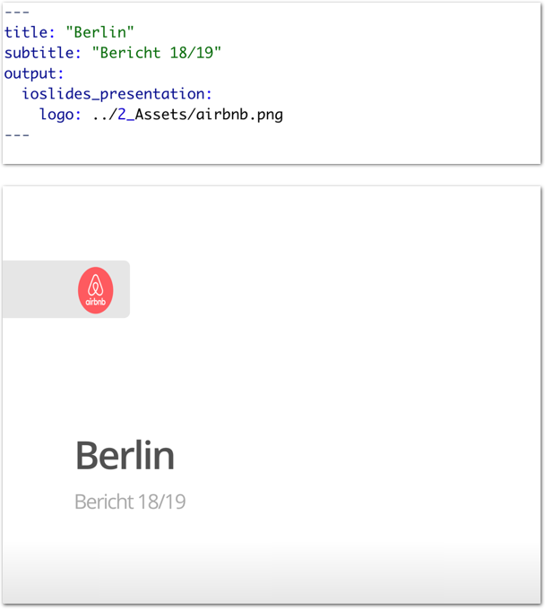

layout: true

<div class="my-footer">
  <span style="text-align:center">
    <span> 
      
    </span>
    <a href="https://therbootcamp.github.io/">
      <span style="padding-left:82px"> 
        <font color="#7E7E7E">
          www.therbootcamp.com
        </font>
      </span>
    </a>
    <a href="https://therbootcamp.github.io/">
      <font color="#7E7E7E">
       Reporting mit R | Juni 2020
      </font>
    </a>
    </span>
  </div> 

---

```{r setup, include=FALSE}
options(htmltools.dir.version = FALSE)
options(width = 110)
options(digits = 4)

# Load packages
require(tidyverse)
require(knitr)

# load color set
source("../../_materials/palette/therbootcamp_palettes.R")

# knitr options
knitr::opts_chunk$set(dpi = 300, 
                      echo = FALSE, 
                      warning = FALSE, 
                      fig.align = 'center', 
                      message= FALSE,
                      comment = NA)
# special print function: avoid if possible
print2 <- function(x, nlines=10,...) {
   cat(head(capture.output(print(x,...)), nlines), sep="\n")}

# load data
airbnb <- read_csv("1_Data/airbnb.csv")

```


.pull-left3[

# Nächste Schritte

<ul>
  <li class="m1"><span>Folien</span></li>
  <ul><br>
    <li><span>YAML</span></li>
    <li><span>Slides kreieren</span></li>
    <li><span>Listen</span></li>
  </ul>
</ul>

]

.pull-right6[

<p align = "center">
  
</p>

]


---

.pull-left4[

# YAML

<ul>
  <li class="m1"><span>Wie in HTML Dokumenten, dient der YAML Head <high>allgemeinen Einstellungen</high>.</span></li>
</ul>

<table style="cellspacing:0; cellpadding:0; border:none; padding-top:10px" width=100%>
  <col width="40%">
  <col width="60%">
<tr>
  <td bgcolor="white">
    <b>Komponente</b>
  </td>
  <td bgcolor="white">
    <b>Beschreibung</b>
  </td> 
</tr>
<tr>
  <td bgcolor="white">
  <mono>subtitle</mono>
  </td>
  <td bgcolor="white">
  Unterschrift auf Titelslide.
  </td> 
</tr>
<tr>
  <td bgcolor="white">
  <mono>logo</mono>
  </td>
  <td bgcolor="white">
  Logo auf Titelslide und in Fusszeile.
  </td> 
</tr>
<tr>
  <td bgcolor="white">
  <mono>css</mono>
  </td>
  <td bgcolor="white">
  Cascading style sheet.
  </td> 
</tr>
</table>

]

.pull-right5[

<br><br>
<p align = "center">
  
</p>

]

---

.pull-left4[

# YAML

<ul>
  <li class="m1"><span>Wie in HTML Dokumenten, dient der YAML Head <high>allgemeinen Einstellungen</high>.</span></li>
</ul>

<table style="cellspacing:0; cellpadding:0; border:none; padding-top:10px" width=100%>
  <col width="40%">
  <col width="60%">
<tr>
  <td bgcolor="white">
    <b>Komponente</b>
  </td>
  <td bgcolor="white">
    <b>Beschreibung</b>
  </td> 
</tr>
<tr>
  <td bgcolor="white">
  <mono>subtitle</mono>
  </td>
  <td bgcolor="white">
  Unterschrift auf Titelslide.
  </td> 
</tr>
<tr>
  <td bgcolor="white">
  <mono>logo</mono>
  </td>
  <td bgcolor="white">
  Logo auf Titelslide und in Fusszeile.
  </td> 
</tr>
<tr>
  <td bgcolor="white">
  <mono>css</mono>
  </td>
  <td bgcolor="white">
  Cascading style sheet.
  </td> 
</tr>
</table>

]

.pull-right5[

<br><br>
<p align = "center">
  
</p>
]

---

.pull-left4[

# YAML

<ul>
  <li class="m1"><span>Wie in HTML Dokumenten, dient der YAML Head <high>allgemeinen Einstellungen</high>.</span></li>
</ul>

<table style="cellspacing:0; cellpadding:0; border:none; padding-top:10px" width=100%>
  <col width="40%">
  <col width="60%">
<tr>
  <td bgcolor="white">
    <b>Komponente</b>
  </td>
  <td bgcolor="white">
    <b>Beschreibung</b>
  </td> 
</tr>
<tr>
  <td bgcolor="white">
  <mono>subtitle</mono>
  </td>
  <td bgcolor="white">
  Unterschrift auf Titelslide.
  </td> 
</tr>
<tr>
  <td bgcolor="white">
  <mono>logo</mono>
  </td>
  <td bgcolor="white">
  Logo auf Titelslide und in Fusszeile.
  </td> 
</tr>
<tr>
  <td bgcolor="white">
  <mono>css</mono>
  </td>
  <td bgcolor="white">
  Cascading style sheet.
  </td> 
</tr>
</table>

]

.pull-right5[

<br><br>
<p align = "center">
  
</p>

]

---

.pull-left4[

# YAML

<ul>
  <li class="m1"><span>Wie in HTML Dokumenten, dient der YAML Head <high>allgemeinen Einstellungen</high>.</span></li>
</ul>

<table style="cellspacing:0; cellpadding:0; border:none; padding-top:10px" width=100%>
  <col width="40%">
  <col width="60%">
<tr>
  <td bgcolor="white">
    <b>Komponente</b>
  </td>
  <td bgcolor="white">
    <b>Beschreibung</b>
  </td> 
</tr>
<tr>
  <td bgcolor="white">
  <mono>subtitle</mono>
  </td>
  <td bgcolor="white">
  Unterschrift auf Titelslide.
  </td> 
</tr>
<tr>
  <td bgcolor="white">
  <mono>logo</mono>
  </td>
  <td bgcolor="white">
  Logo auf Titelslide und in Fusszeile.
  </td> 
</tr>
<tr>
  <td bgcolor="white">
  <mono>css</mono>
  </td>
  <td bgcolor="white">
  Cascading style sheet.
  </td> 
</tr>
</table>

]

.pull-right5[
<br><br>
<p align = "center">
  
</p>

]


---

.pull-left4[

# Slides

<ul>
  <li class="m1"><span><mono>ioslides</mono> erwarten eine leicht <high>veränderte Markup Syntax</high>.</span></li>
</ul>

<table style="cellspacing:0; cellpadding:0; border:none; padding-top:10px" width=100%>
  <col width="40%">
  <col width="60%">
<tr>
  <td bgcolor="white">
    <b>Markup</b>
  </td>
  <td bgcolor="white">
    <b>Beschreibung</b>
  </td> 
</tr>
<tr>
  <td bgcolor="white">
  <mono>#, ##</mono>
  </td>
  <td bgcolor="white">
  Neue(r) Abschnitt, Folie.
  </td> 
</tr>
<tr>
  <td bgcolor="white">
  <mono>## Titel | </mono>
  </td>
  <td bgcolor="white">
  Untertitel.
  </td> 
</tr>
<tr>
  <td bgcolor="white">
  <mono>-<br>-</mono>
  </td>
  <td bgcolor="white">
  Nicht-numerierte Bullets.
  </td> 
</tr>
<tr>
  <td bgcolor="white">
  <mono>1.<br>2.</mono>
  </td>
  <td bgcolor="white">
  Numerierte Bullets.
  </td> 
</tr>
<tr>
  <td bgcolor="white">
  <mono>&gt;-, &gt;1.<br>&gt;-, &gt;2.</mono>
  </td>
  <td bgcolor="white">
  Gestaffelte Bullets.
  </td> 
</tr>
<tr>
  <td bgcolor="white">
  <mono>{.flexbox, .build, .smaller}</mono>
  </td>
  <td bgcolor="white">
  Slideoptionen.
  </td> 
</tr>
</table>

]

.pull-right5[
<br><br>
<p align = "center">
  
</p>

]

---

.pull-left4[

# Slides

<ul>
  <li class="m1"><span><mono>ioslides</mono> erwarten eine leicht <high>veränderte Markup Syntax</high>.</span></li>
</ul>

<table style="cellspacing:0; cellpadding:0; border:none; padding-top:10px" width=100%>
  <col width="40%">
  <col width="60%">
<tr>
  <td bgcolor="white">
    <b>Markup</b>
  </td>
  <td bgcolor="white">
    <b>Beschreibung</b>
  </td> 
</tr>
<tr>
  <td bgcolor="white">
  <mono>#, ##</mono>
  </td>
  <td bgcolor="white">
  Neue(r) Abschnitt, Folie.
  </td> 
</tr>
<tr>
  <td bgcolor="white">
  <mono>## Titel | </mono>
  </td>
  <td bgcolor="white">
  Untertitel.
  </td> 
</tr>
<tr>
  <td bgcolor="white">
  <mono>-<br>-</mono>
  </td>
  <td bgcolor="white">
  Nicht-numerierte Bullets.
  </td> 
</tr>
<tr>
  <td bgcolor="white">
  <mono>1.<br>2.</mono>
  </td>
  <td bgcolor="white">
  Numerierte Bullets.
  </td> 
</tr>
<tr>
  <td bgcolor="white">
  <mono>&gt;-, &gt;1.<br>&gt;-, &gt;2.</mono>
  </td>
  <td bgcolor="white">
  Gestaffelte Bullets.
  </td> 
</tr>
<tr>
  <td bgcolor="white">
  <mono>{.flexbox, .build, .smaller}</mono>
  </td>
  <td bgcolor="white">
  Slideoptionen.
  </td> 
</tr>
</table>

]

.pull-right5[
<br><br>
<p align = "center">
  
</p>

]

---

.pull-left4[

# Slides

<ul>
  <li class="m1"><span><mono>ioslides</mono> erwarten eine leicht <high>veränderte Markup Syntax</high>.</span></li>
</ul>

<table style="cellspacing:0; cellpadding:0; border:none; padding-top:10px" width=100%>
  <col width="40%">
  <col width="60%">
<tr>
  <td bgcolor="white">
    <b>Markup</b>
  </td>
  <td bgcolor="white">
    <b>Beschreibung</b>
  </td> 
</tr>
<tr>
  <td bgcolor="white">
  <mono>#, ##</mono>
  </td>
  <td bgcolor="white">
  Neue(r) Abschnitt, Folie.
  </td> 
</tr>
<tr>
  <td bgcolor="white">
  <mono>## Titel | </mono>
  </td>
  <td bgcolor="white">
  Untertitel.
  </td> 
</tr>
<tr>
  <td bgcolor="white">
  <mono>-<br>-</mono>
  </td>
  <td bgcolor="white">
  Nicht-numerierte Bullets.
  </td> 
</tr>
<tr>
  <td bgcolor="white">
  <mono>1.<br>2.</mono>
  </td>
  <td bgcolor="white">
  Numerierte Bullets.
  </td> 
</tr>
<tr>
  <td bgcolor="white">
  <mono>&gt;-, &gt;1.<br>&gt;-, &gt;2.</mono>
  </td>
  <td bgcolor="white">
  Gestaffelte Bullets.
  </td> 
</tr>
<tr>
  <td bgcolor="white">
  <mono>{.flexbox, .build, .smaller}</mono>
  </td>
  <td bgcolor="white">
  Slideoptionen.
  </td> 
</tr>
</table>

]

.pull-right5[
<br><br>
<p align = "center">
  
</p>

]

---

.pull-left4[

# Slides

<ul>
  <li class="m1"><span><mono>ioslides</mono> erwarten eine leicht <high>veränderte Markup Syntax</high>.</span></li>
</ul>

<table style="cellspacing:0; cellpadding:0; border:none; padding-top:10px" width=100%>
  <col width="40%">
  <col width="60%">
<tr>
  <td bgcolor="white">
    <b>Markup</b>
  </td>
  <td bgcolor="white">
    <b>Beschreibung</b>
  </td> 
</tr>
<tr>
  <td bgcolor="white">
  <mono>#, ##</mono>
  </td>
  <td bgcolor="white">
  Neue(r) Abschnitt, Folie.
  </td> 
</tr>
<tr>
  <td bgcolor="white">
  <mono>## Titel | </mono>
  </td>
  <td bgcolor="white">
  Untertitel.
  </td> 
</tr>
<tr>
  <td bgcolor="white">
  <mono>-<br>-</mono>
  </td>
  <td bgcolor="white">
  Nicht-numerierte Bullets.
  </td> 
</tr>
<tr>
  <td bgcolor="white">
  <mono>1.<br>2.</mono>
  </td>
  <td bgcolor="white">
  Numerierte Bullets.
  </td> 
</tr>
<tr>
  <td bgcolor="white">
  <mono>&gt;-, &gt;1.<br>&gt;-, &gt;2.</mono>
  </td>
  <td bgcolor="white">
  Gestaffelte Bullets.
  </td> 
</tr>
<tr>
  <td bgcolor="white">
  <mono>{.flexbox, .build, .smaller}</mono>
  </td>
  <td bgcolor="white">
  Slideoptionen.
  </td> 
</tr>
</table>

]

.pull-right5[
<br><br>
<p align = "center">
  
</p>

]

---

.pull-left4[

# Slides

<ul>
  <li class="m1"><span><mono>ioslides</mono> erwarten eine leicht <high>veränderte Markup Syntax</high>.</span></li>
</ul>

<table style="cellspacing:0; cellpadding:0; border:none; padding-top:10px" width=100%>
  <col width="40%">
  <col width="60%">
<tr>
  <td bgcolor="white">
    <b>Markup</b>
  </td>
  <td bgcolor="white">
    <b>Beschreibung</b>
  </td> 
</tr>
<tr>
  <td bgcolor="white">
  <mono>#, ##</mono>
  </td>
  <td bgcolor="white">
  Neue(r) Abschnitt, Folie.
  </td> 
</tr>
<tr>
  <td bgcolor="white">
  <mono>## Titel | </mono>
  </td>
  <td bgcolor="white">
  Untertitel.
  </td> 
</tr>
<tr>
  <td bgcolor="white">
  <mono>-<br>-</mono>
  </td>
  <td bgcolor="white">
  Nicht-numerierte Bullets.
  </td> 
</tr>
<tr>
  <td bgcolor="white">
  <mono>1.<br>2.</mono>
  </td>
  <td bgcolor="white">
  Numerierte Bullets.
  </td> 
</tr>
<tr>
  <td bgcolor="white">
  <mono>&gt;-, &gt;1.<br>&gt;-, &gt;2.</mono>
  </td>
  <td bgcolor="white">
  Gestaffelte Bullets.
  </td> 
</tr>
<tr>
  <td bgcolor="white">
  <mono>{.flexbox, .build, .smaller}</mono>
  </td>
  <td bgcolor="white">
  Slideoptionen.
  </td> 
</tr>
</table>

]

.pull-right5[
<br><br>
<p align = "center">
  
</p>

]

---

.pull-left4[

# Slides

<ul>
  <li class="m1"><span><mono>ioslides</mono> erwarten eine leicht <high>veränderte Markup Syntax</high>.</span></li>
</ul>

<table style="cellspacing:0; cellpadding:0; border:none; padding-top:10px" width=100%>
  <col width="40%">
  <col width="60%">
<tr>
  <td bgcolor="white">
    <b>Markup</b>
  </td>
  <td bgcolor="white">
    <b>Beschreibung</b>
  </td> 
</tr>
<tr>
  <td bgcolor="white">
  <mono>#, ##</mono>
  </td>
  <td bgcolor="white">
  Neue(r) Abschnitt, Folie.
  </td> 
</tr>
<tr>
  <td bgcolor="white">
  <mono>## Titel | </mono>
  </td>
  <td bgcolor="white">
  Untertitel.
  </td> 
</tr>
<tr>
  <td bgcolor="white">
  <mono>-<br>-</mono>
  </td>
  <td bgcolor="white">
  Nicht-numerierte Bullets.
  </td> 
</tr>
<tr>
  <td bgcolor="white">
  <mono>1.<br>2.</mono>
  </td>
  <td bgcolor="white">
  Numerierte Bullets.
  </td> 
</tr>
<tr>
  <td bgcolor="white">
  <mono>&gt;-, &gt;1.<br>&gt;-, &gt;2.</mono>
  </td>
  <td bgcolor="white">
  Gestaffelte Bullets.
  </td> 
</tr>
<tr>
  <td bgcolor="white">
  <mono>{.flexbox, .build, .smaller}</mono>
  </td>
  <td bgcolor="white">
  Slideoptionen.
  </td> 
</tr>
</table>

]

.pull-right5[
<br><br>
<p align = "center">
  
</p>

]

---

.pull-left4[

# Slides

<ul>
  <li class="m1"><span><mono>ioslides</mono> erwarten eine leicht <high>veränderte Markup Syntax</high>.</span></li>
</ul>

<table style="cellspacing:0; cellpadding:0; border:none; padding-top:10px" width=100%>
  <col width="40%">
  <col width="60%">
<tr>
  <td bgcolor="white">
    <b>Markup</b>
  </td>
  <td bgcolor="white">
    <b>Beschreibung</b>
  </td> 
</tr>
<tr>
  <td bgcolor="white">
  <mono>#, ##</mono>
  </td>
  <td bgcolor="white">
  Neue(r) Abschnitt, Folie.
  </td> 
</tr>
<tr>
  <td bgcolor="white">
  <mono>## Titel | </mono>
  </td>
  <td bgcolor="white">
  Untertitel.
  </td> 
</tr>
<tr>
  <td bgcolor="white">
  <mono>-<br>-</mono>
  </td>
  <td bgcolor="white">
  Nicht-numerierte Bullets.
  </td> 
</tr>
<tr>
  <td bgcolor="white">
  <mono>1.<br>2.</mono>
  </td>
  <td bgcolor="white">
  Numerierte Bullets.
  </td> 
</tr>
<tr>
  <td bgcolor="white">
  <mono>&gt;-, &gt;1.<br>&gt;-, &gt;2.</mono>
  </td>
  <td bgcolor="white">
  Gestaffelte Bullets.
  </td> 
</tr>
<tr>
  <td bgcolor="white">
  <mono>{.flexbox, .build, .smaller}</mono>
  </td>
  <td bgcolor="white">
  Slideoptionen.
  </td> 
</tr>
</table>

]

.pull-right5[
<br><br>
<p align = "center">
  
</p>

]

---

.pull-left4[

# Slides

<ul>
  <li class="m1"><span><mono>ioslides</mono> erwarten eine leicht <high>veränderte Markup Syntax</high>.</span></li>
</ul>

<table style="cellspacing:0; cellpadding:0; border:none; padding-top:10px" width=100%>
  <col width="40%">
  <col width="60%">
<tr>
  <td bgcolor="white">
    <b>Markup</b>
  </td>
  <td bgcolor="white">
    <b>Beschreibung</b>
  </td> 
</tr>
<tr>
  <td bgcolor="white">
  <mono>#, ##</mono>
  </td>
  <td bgcolor="white">
  Neue(r) Abschnitt, Folie.
  </td> 
</tr>
<tr>
  <td bgcolor="white">
  <mono>## Titel | </mono>
  </td>
  <td bgcolor="white">
  Untertitel.
  </td> 
</tr>
<tr>
  <td bgcolor="white">
  <mono>-<br>-</mono>
  </td>
  <td bgcolor="white">
  Nicht-numerierte Bullets.
  </td> 
</tr>
<tr>
  <td bgcolor="white">
  <mono>1.<br>2.</mono>
  </td>
  <td bgcolor="white">
  Numerierte Bullets.
  </td> 
</tr>
<tr>
  <td bgcolor="white">
  <mono>&gt;-, &gt;1.<br>&gt;-, &gt;2.</mono>
  </td>
  <td bgcolor="white">
  Gestaffelte Bullets.
  </td> 
</tr>
<tr>
  <td bgcolor="white">
  <mono>{.flexbox, .build, .smaller}</mono>
  </td>
  <td bgcolor="white">
  Slideoptionen.
  </td> 
</tr>
</table>

]

.pull-right5[
<br><br>
<p align = "center">
  
</p>

]


---

.pull-left4[

# Slides

<ul>
  <li class="m1"><span><mono>ioslides</mono> erwarten eine leicht <high>veränderte Markup Syntax</high>.</span></li>
</ul>

<table style="cellspacing:0; cellpadding:0; border:none; padding-top:10px" width=100%>
  <col width="40%">
  <col width="60%">
<tr>
  <td bgcolor="white">
    <b>Markup</b>
  </td>
  <td bgcolor="white">
    <b>Beschreibung</b>
  </td> 
</tr>
<tr>
  <td bgcolor="white">
  <mono>#, ##</mono>
  </td>
  <td bgcolor="white">
  Neue(r) Abschnitt, Folie.
  </td> 
</tr>
<tr>
  <td bgcolor="white">
  <mono>## Titel | </mono>
  </td>
  <td bgcolor="white">
  Untertitel.
  </td> 
</tr>
<tr>
  <td bgcolor="white">
  <mono>-<br>-</mono>
  </td>
  <td bgcolor="white">
  Nicht-numerierte Bullets.
  </td> 
</tr>
<tr>
  <td bgcolor="white">
  <mono>1.<br>2.</mono>
  </td>
  <td bgcolor="white">
  Numerierte Bullets.
  </td> 
</tr>
<tr>
  <td bgcolor="white">
  <mono>&gt;-, &gt;1.<br>&gt;-, &gt;2.</mono>
  </td>
  <td bgcolor="white">
  Gestaffelte Bullets.
  </td> 
</tr>
<tr>
  <td bgcolor="white">
  <mono>{.flexbox, .build, .smaller}</mono>
  </td>
  <td bgcolor="white">
  Slideoptionen.
  </td> 
</tr>
</table>

]

.pull-right5[
<br><br>
<p align = "center">
  <br>
      <font style="font-size:10px">from <a href="https://twitter.com/hadleywickham">twitter.com</a></font>
</p>


]


---

.pull-left4[

# Slides

<ul>
  <li class="m1"><span><mono>ioslides</mono> erwarten eine leicht <high>veränderte Markup Syntax</high>.</span></li>
</ul>

<table style="cellspacing:0; cellpadding:0; border:none; padding-top:10px" width=100%>
  <col width="40%">
  <col width="60%">
<tr>
  <td bgcolor="white">
    <b>Markup</b>
  </td>
  <td bgcolor="white">
    <b>Beschreibung</b>
  </td> 
</tr>
<tr>
  <td bgcolor="white">
  <mono>#, ##</mono>
  </td>
  <td bgcolor="white">
  Neue(r) Abschnitt, Folie.
  </td> 
</tr>
<tr>
  <td bgcolor="white">
  <mono>## Titel | </mono>
  </td>
  <td bgcolor="white">
  Untertitel.
  </td> 
</tr>
<tr>
  <td bgcolor="white">
  <mono>-<br>-</mono>
  </td>
  <td bgcolor="white">
  Nicht-numerierte Bullets.
  </td> 
</tr>
<tr>
  <td bgcolor="white">
  <mono>1.<br>2.</mono>
  </td>
  <td bgcolor="white">
  Numerierte Bullets.
  </td> 
</tr>
<tr>
  <td bgcolor="white">
  <mono>&gt;-, &gt;1.<br>&gt;-, &gt;2.</mono>
  </td>
  <td bgcolor="white">
  Gestaffelte Bullets.
  </td> 
</tr>
<tr>
  <td bgcolor="white">
  <mono>{.flexbox, .build, .smaller}</mono>
  </td>
  <td bgcolor="white">
  Slideoptionen.
  </td> 
</tr>
</table>

]

.pull-right5[
<br><br>
<p align = "center">
  <br>
    <font style="font-size:10px">see <a href="https://www.youtube.com/watch?v=s9aWmU0atlQ">youtube.com</a></font>
</p>

]


---

class: middle, center

<h1><a href="https://therbootcamp.github.io/RmR_2020Jun/_sessions/Markdown4/Markdown4_practical.html">Practical</a></h1>

