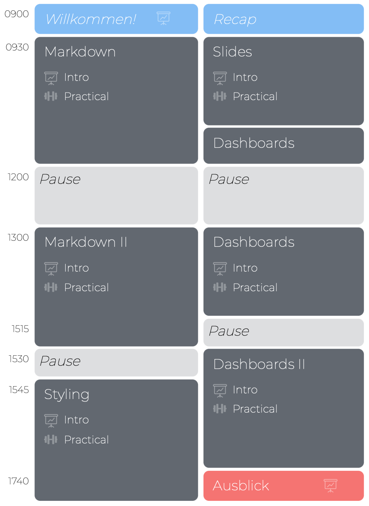

layout: true

<div class="my-footer">
  <span style="text-align:center">
    <span> 
      
    </span>
    <a href="https://therbootcamp.github.io/">
      <span style="padding-left:82px"> 
        <font color="#7E7E7E">
          www.therbootcamp.com
        </font>
      </span>
    </a>
    <a href="https://therbootcamp.github.io/">
      <font color="#7E7E7E">
       Reporting mit R | Juni 2020
      </font>
    </a>
    </span>
  </div> 

---


```{r setup, include=FALSE}
options(htmltools.dir.version = FALSE)
options(width=110)
options(digits = 4)

knitr::opts_chunk$set(fig.align = 'center')
```


.pull-left45[
<br><br><br><br><br>
#  Agenda und Materialien

Klicke auf <high>"....running..."</high> auf unserer Website!

<font style="font-size:28px"><a href="www.therbootcamp.com"><b>www.therbootcamp.com</b></a></font>

]

.pull-right5[

<br><br>
<iframe src="https://therbootcamp.github.io/RmR_2020Jun/" width="500" height="500"></iframe>

]


---

.pull-left6[

<br><br><br>


# Ziel


>### Das Ziel dieses Kurses ist Euch die nötigen Fähigkeiten zum Erstellen dynamischer Reporte und Dashboards in R zu vermitteln. 

]

.pull-right4[

<br><br><br><br>
<p align="center"></p>

]

---

.pull-left3[

# Der Data Science Kreislauf

]

.pull-right7[
<br>
<p align = "center">
<br>
<font style="font-size:10px">from <a href="http://sudeep.co/">http://sudeep.co/</a></font>
</p>
]


---

.pull-left4[

# Reporting in R


<ul>
  <li class="m1"><span>Reporting Pakete gehören zu den <high>populärsten R Paketen</high> überhaupt.</span></li>
  <li class="m2"><span>Reporting Pakete werden deutlich häufiger runtergeladen als die bedeutendsten <high>Statistikpakete</high>.</span></li>
</ul>

]

.pull-right5[
<br><br>
<p align="center"></p>

]


---
.pull-left4[

<br>
# Agenda 

<ul>
  <li class="m1"><span><high>Workshop</high></span></li>
  <ul class="level">
    <li><span>2 Blöcke Markdown Grundlagen</span></li>
    <li><span>1 Block zu Styling</span></li>
    <li><span>1 Block zu Slides</span></li>
    <li><span>2 Blöcke zu interaktiven Dashboards</span></li>
  </ul><br>
  <li class="m2"><span><high>Block</high>
  <ul class="level">
    <li><span>Folien-basierte Einführung</span></li>
    <li><span>Viele Übungen</span></li>
    <li><span>Interaktive Zusammenfassung</span></li>
  </ul>
  </span></li>
</ul>

]

.pull-right45[
<br><br>


]


---

# Einführung

.pull-left45[
<br2>

<ul>
  <li class="m1"><span><high>Einführung</high>
  <br><br>
  <ul class="level">
    <li><span>30-45 min</span></li>
    <li><span>Konzepte & Code Beispiele</span></li>
  </ul>
  </span></li>
  <li class="m2"><span><high>Materialien</high>
  <br><br>
  <ul class="level">
    <li><span>Immer <a href="https://therbootcamp.github.io/RmR_2020Jun/">online verfügbar</a></span></li>
  </ul>
  </span></li>
</ul>

]

.pull-right55[

<p align="center">

<br>
<font style="font-size:10px">from <a href="www.Freepik.com">Freepik.com</a></font>
</p>

]


---

.pull-left45[

# Übungen


<ul>
  <li class="m1"><span><high>Selber Programmieren</high>
  <br><br>
  <ul class="level">
    <li><span>20 - 50 Aufgaben</span></li>
    <li><span>Zu Beginn einfach dann zunehmend schwieriger.</span></li>
    <li><span>Folgt Eurem eigenen Tempo.</span></li>
    <li><span>Antworten kommen später.</span></li>
  </ul>
  </span></li>
</ul>

]


.pull-right5[
<br>

  <iframe src="https://therbootcamp.github.io/RmR_2020Jun/_sessions/Markdown/Markdown_practical.html" height="480px" width = "500px"></iframe>

  Beispiel:<a href="https://therbootcamp.github.io/RmR_2020Jun/_sessions/Markdown/Markdown_practical.html"> Markdown </a>

]

---

# Vorstellung

.pull-left5[

<ul>
  <li class="m1"><span>Wie heisst Du?</span></li>
  <li class="m2"><span>Was ist dein Beruf?</span></li>
  <li class="m3"><span>Hast du Programmiererfahrung mit R oder anderen Programmiersprachen?</span></li>
  <li class="m4"><span>Wieviel Erfahrung hast du mit Reporting mit R oder mit einer anderen Software?</span></li>
  <li class="m5"><span>Kaffee oder Tee?</span></li>
  <li class="m6"><span>Bier oder Wein?</span></li>
  <li class="m7"><span>Berlin oder Paris?</span></li>
</ul>

]

.pull-right45[

<p align="center">

<br>
<font style="font-size:10px">from <a href="www.artofmanliness.com">artofmanliness.com</a></font>
</p>

]

---
class: middle, center

<h1><a href=https://therbootcamp.github.io/RmR_2020Jun/index.html>Agenda</a></h1>
